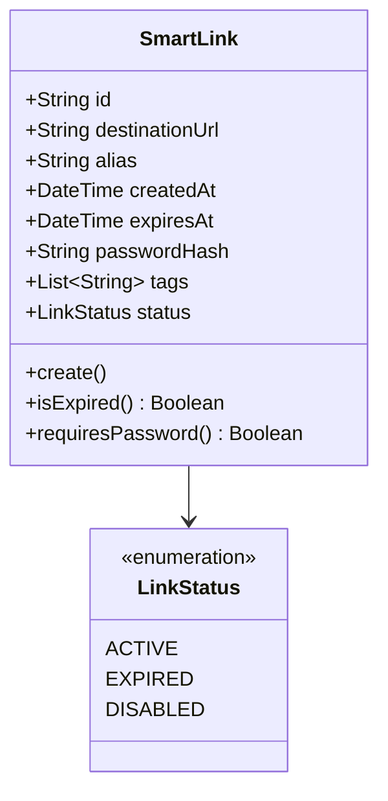
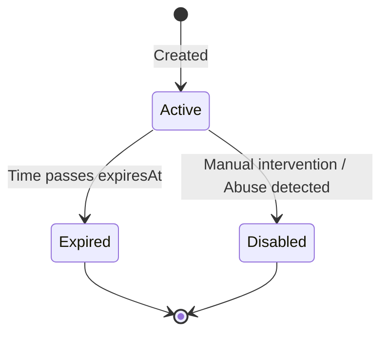

# LinkForge Feature Design Document
**Epic 1:** Link Management
**Story 1.1:** Create Smart Link

---

## 1. Executive Summary
The "Create Smart Link" feature is the core entry point for the LinkForge platform. It transforms standard URLs into intelligent, trackable, and programmable assets. This document outlines the comprehensive design of the creation flow, emphasizing a Domain-Driven, modular architecture built for high availability and low-latency redirection, laying the foundation for advanced analytics and dynamic routing.

## 2. Feature Overview
Users can create a Smart Link by providing a destination URL. The system will either generate a unique alias or accept a custom alias. Users can also configure intelligent rules such as expiration dates, password protection, and metadata tags during creation.

## 3. Problem Statement
Long URLs are difficult to share and impossible to track. Traditional shorteners treat links as static pointers. LinkForge users need links that are dynamic, secure, and context-aware. The system must capture intent and metadata at creation to power future features like conditional routing and deep analytics, without introducing friction into the basic creation flow.

## 4. Business Goals
- Deliver a frictionless, sub-second link creation experience.
- Capture foundational data required for downstream analytics and redirect engines.
- Differentiate from basic URL shorteners by exposing "smart" configuration options (expiration, security) upfront.

## 5. Success Metrics
- **P95 Creation Latency:** < 200ms.
- **Creation Success Rate:** > 99.9%.
- **Adoption:** 30% of created links utilize at least one "smart" feature (custom alias, expiry, password).
- **Collision Rate:** 0% (Custom aliases must be strictly unique).

## 6. Product Vision
This feature serves as the foundational data ingestion point for the LinkForge ecosystem:
- **Redirect Engine:** Consumes the Smart Link data to route traffic.
- **Analytics:** Uses the link ID to aggregate click streams.
- **Dashboard/Collections:** Groups links using the tags applied at creation.
- **Smart Rules:** Future rules (geo-targeting, A/B testing) will extend the schema defined here.
- **API Platform:** Exposes this exact functionality for programmatic creation.
- **Authentication (future):** Anonymous links can be claimed once the user registers.

## 7. User Personas
**Primary Users:**
- **Marketing Managers:** Need branded (custom alias) and trackable links for campaigns.
- **Developers:** Need a reliable API to programmatically generate links for application flows.

**Secondary Users:**
- **Casual Users:** Need a quick way to shorten a link for social sharing.

**Pain Points:** Existing tools are too simplistic, lack immediate metadata tagging, and don't scale well for API-driven creation.

**Goals/Needs:** Speed, reliability, uniqueness guarantees, and rich configuration options natively built-in.

## 8. User Stories
- As a User, I want to paste a long URL and get a short link immediately, so I can share it quickly.
- As a Marketer, I want to specify a custom alias, so my links match my brand identity.
- As a Campaign Manager, I want to set an expiration date, so the link automatically disables when the campaign ends.
- As a Security-conscious User, I want to password-protect my link, so only authorized users can access the destination.
- As an Organizer, I want to add tags to my link upon creation, so I can easily filter my links in the dashboard later.

## 9. Functional Requirements
**Required Inputs:**
- `destinationUrl` (Valid HTTP/HTTPS URL)

**Optional Inputs:**
- `customAlias` (Alphanumeric string, hyphens allowed)
- `expiresAt` (ISO 8601 Date/Time in the future)
- `password` (String)
- `tags` (Array of strings)

**Outputs:**
- `id` (System identifier)
- `shortUrl` (The fully qualified short URL)
- `alias` (The generated or custom alias)
- `createdAt`

**User Actions:**
- Submit URL form.
- Toggle advanced options (Alias, Expiry, Password, Tags).

**System Behaviour:**
- Validate URL format and safety (preventing internal IP routing/malicious URLs).
- Check `customAlias` availability. If absent, generate a unique Base62 string.
- Hash the `password` using bcrypt before persistence.
- Persist link data.
- Return the created link object.

**Validation Rules:**
- `destinationUrl`: Must be valid URL, max length 2048 chars, HTTP/HTTPS only.
- `customAlias`: Min 4 chars, Max 50 chars, regex `^[a-zA-Z0-9-]+$`.
- `password`: Min 8 chars if provided.
- `expiresAt`: Must be > current time.
- `tags`: Max 10 tags per link, max 20 chars per tag.

## 10. Non Functional Requirements
- **Performance:** Creation API must respond in < 200ms.
- **Scalability:** Must support bursts of 1000 creations/sec.
- **Availability:** 99.99% uptime for the creation API.
- **Reliability:** No data loss upon successful API response.
- **Security:** Prevent Server-Side Request Forgery (SSRF). Hash passwords.
- **Accessibility:** UI must be WCAG 2.1 AA compliant.
- **Maintainability:** Pure functions for alias generation. Dependency injection for repositories.
- **Observability:** Centralized logging with trace IDs.

## 11. Business Rules
| Rule | Reason | Trade-off |
|------|--------|-----------|
| **Alias Immutability** | Once an alias is assigned to a destination, it cannot be changed. | Ensures persistent mapping, but users must create a new link if they make a typo. |
| **Reserved Aliases** | Aliases like 'api', 'admin', 'dashboard' are blocked. | Prevents route collisions with the application frontend/backend. Requires maintaining a blacklist. |
| **No Chained Shorteners** | Destination URL cannot be another known shortener (e.g., bit.ly). | Prevents infinite redirect loops and abuse. Increases validation latency slightly. |
| **Generated Alias Length** | Default generated aliases will be 7 characters (Base62). | ~3.5 trillion combinations. Good balance between shortness and collision resistance. |

## 12. Domain Model



**Aggregate Root:** `SmartLink`
**Entities:** `SmartLink`
**Value Objects:** `Url`, `Alias`, `Tag`
**Responsibilities:** Ensures its own invariants (e.g., expiry date is in the future).
**Relationships:** Independent root in this bounded context. (Future: Belongs to `User` or `Workspace`).

**State Machine:**


## 13. Data Model

**Properties:**
- `id`: UUIDv4 (Primary Key)
- `destinationUrl`: String (Required, 2048 chars)
- `alias`: String (Required, Unique, 50 chars)
- `passwordHash`: String (Optional)
- `expiresAt`: DateTime (Optional)
- `status`: Enum (Required, default 'ACTIVE')
- `tags`: JSON (Optional, array of strings)
- `createdAt`: DateTime (Required)
- `updatedAt`: DateTime (Required)

**Relationships:** 
- Tags are denormalized as a JSON array for simplicity and read performance.

**Derived/Computed Fields:**
- `isExpired`: Computed dynamically based on `expiresAt` < NOW().
- `shortUrl`: Computed at the API boundary using `BASE_DOMAIN` + `alias`.

**Indexes:**
- Unique Index on `alias` (Critical).
- Index on `createdAt` (For sorting).

## 14. API Design

**Endpoint:** `POST /api/v1/links`
**Purpose:** Create a new Smart Link.

**Request Body (application/json):**
```json
{
  "destinationUrl": "https://example.com/very-long-article-name",
  "customAlias": "my-article",
  "password": "securePassword123",
  "expiresAt": "2024-12-31T23:59:59Z",
  "tags": ["marketing", "q4"]
}
```

**Response (201 Created):**
```json
{
  "success": true,
  "data": {
    "id": "uuid-1234",
    "shortUrl": "https://lnk.fg/my-article",
    "alias": "my-article",
    "destinationUrl": "https://example.com/very-long-article-name",
    "hasPassword": true,
    "expiresAt": "2024-12-31T23:59:59Z",
    "tags": ["marketing", "q4"],
    "status": "ACTIVE",
    "createdAt": "2024-05-01T12:00:00Z"
  }
}
```

**Status Codes & Errors:**
- `201 Created`: Success.
- `400 Bad Request`: Validation failure (Zod errors).
- `409 Conflict`: Custom alias already exists.
- `422 Unprocessable Entity`: Destination URL is blocked.
- `429 Too Many Requests`: Rate limit exceeded.

**Versioning:** Prefixed with `/api/v1`. Future breaking changes will introduce `v2`.

## 15. UI / UX Design

**User Flow:**
1. User lands on Dashboard/Home.
2. Prominent input field for Destination URL.
3. User clicks "Options" to expand advanced settings (Alias, Password, Expiry, Tags).
4. User clicks "Create".
5. Button shows loading spinner.
6. On success, the UI displays the generated short link with a prominent "Copy to Clipboard" button and a success toast.
7. The new link appears at the top of the "Recent Links" list.

**Components:**
- `CreateLinkForm`: Form wrapper managing state and submission.
- `UrlInput`: Large, clear input with paste-from-clipboard adornment.
- `AdvancedSettingsToggle`: Accordion for optional fields.
- `AliasInput`: Input with debounced availability check (green check/red cross indicator).
- `TagSelector`: Combobox for adding/removing tags.

**States:**
- **Loading:** Skeleton loaders for the result area; disabled state for the submit button.
- **Error:** Inline validation errors (Zod + React Hook Form). General API errors via toast notifications.
- **Empty:** Focus is automatically placed in the main URL input.

## 16. Backend Design

**Folder Structure (Clean Architecture):**
```
src/
└── modules/
    └── links/
        ├── controllers/
        │   └── createLink.controller.ts
        ├── services/
        │   └── createLink.service.ts
        ├── repositories/
        │   └── link.repository.ts
        ├── models/
        │   └── link.domain.ts
        ├── validators/
        │   └── createLink.schema.ts
        └── utils/
            └── aliasGenerator.ts
```

**Module Justifications:**
- **Controller:** Strictly handles HTTP request/response parsing and formatting.
- **Service:** Contains core business logic (hashing password, alias generation/retry loop).
- **Repository:** Abstracts database calls. Justified here to decouple the ORM from business logic, allowing easy mocking for tests and future caching layers.
- **Utils (aliasGenerator):** Isolated pure function for easy unit testing.

## 17. Frontend Design

**Folder Structure (Feature-Based):**
```
src/
└── features/
    └── links/
        ├── api/
        │   └── useCreateLink.ts
        ├── components/
        │   ├── CreateLinkForm.tsx
        │   ├── AdvancedOptions.tsx
        │   └── LinkSuccessCard.tsx
        └── schemas/
            └── createLinkSchema.ts
```

**Design Choices:**
- **State Management:** React Hook Form for local form state. TanStack Query for server state and mutations.
- **Validation:** Zod schema shared with backend.
- **API Layer:** `useCreateLink` hook isolates fetch logic and handles optimistic cache invalidation for the links list.
- **Reusable Components:** `TagSelector` and `AliasInput` are generic enough to be moved to a shared UI folder if used elsewhere.

## 18. Database Design

**Tables:**
`SmartLink` table in PostgreSQL.

**Relationships:** 
Independent table for now. Will map to `User` table when Auth is introduced via a nullable `userId` foreign key.

**Constraints:**
- `UNIQUE(alias)`
- `CHECK(length(alias) >= 4)`

**Indexes:**
- B-Tree unique index on `alias`.

**Migration Strategy:**
Standard Prisma migration. Safe to deploy incrementally. 

## 19. Edge Cases
- **Business:** User requests an alias that violates brand guidelines or contains profanity.
- **Technical (Race Condition):** Two users request the same custom alias simultaneously. The unique DB constraint will throw an error, which the repository catches and translates to a 409 Conflict.
- **Technical (Collision):** The random generator creates an alias that exists. The service layer implements a retry loop (max 3 retries) before failing.
- **User Behaviour:** User submits the same destination URL multiple times. System creates unique aliases for each unless a custom alias is requested.

## 20. Security Review
- **SSRF Prevention:** Validate that `destinationUrl` does not point to internal IP ranges or localhost.
- **Injection Prevention:** Prisma ORM inherently protects against SQL injection.
- **Abuse Prevention:** Rate limiting (e.g., 10 creations / minute / IP) via Redis.
- **Authorization:** Future enhancement.
- **Validation:** Strict input validation using Zod ensures no malformed payloads reach the database.

## 21. Performance Review
- **Caching:** Alias lookups for redirection will be cached, but creation always hits the primary DB.
- **Expected Query Patterns:** High write throughput on the `SmartLink` table.
- **Latency Targets:** DB write < 50ms. API response < 200ms.

## 22. Scalability Review
- **100 users:** Single Node.js instance, Single PostgreSQL instance.
- **10k users:** Add rate limiting via Redis. 
- **1M users:** Read replicas for the redirect engine, horizontal scaling of the Node API.
- **100M users:** PostgreSQL partitions or migration of the mapping table to DynamoDB. 
- **Bottlenecks:** The Master PostgreSQL write capacity is the primary bottleneck.

## 23. Logging Strategy
- Use structured JSON logging (e.g., Winston/Pino).
- Log successful creations at `INFO` with `alias`, `hasPassword` flags (no PII).
- Log database collisions at `WARN` level.
- Ensure trace IDs flow through the request for observability.

## 24. Monitoring Strategy
- **Metrics:**
  - `links.created.total`
  - `links.creation.latency`
  - `links.creation.errors`
  - `links.alias.collisions`
- Monitor Redis memory for rate limiters.

## 25. Testing Strategy
- **Unit:** Test `aliasGenerator` (randomness, length). Test `createLink.service` with mocked repository for collision retry logic.
- **Integration:** Test the controller with an in-memory/test DB to verify Prisma constraints.
- **API:** E2E tests using Supertest for 201, 400, and 409 codes.
- **UI:** React Testing Library for form validation and loading states.
- **Security:** Inject SSRF payloads and excessively long strings.

## 26. Future Enhancements
- **Link Previews:** Asynchronously fetch OpenGraph metadata from the destination URL.
- **Bulk Creation:** API endpoint for CSV uploads.
- **UTM Builder:** UI interface for constructing UTM parameters.

## 27. Risks
- **Technical:** High collision rates if the random generator entropy is low.
- **Business:** The platform is abused for spam, leading to domain blacklisting.
- **Security:** Users circumvent rate limits by rotating IPs.

## 28. Architecture Decision Records (ADR)

**ADR 1: Alias Generation Strategy**
- **Decision:** Use Base62 encoding for a 7-character generated alias.
- **Reason:** Provides ~3.5 trillion combinations, balancing shortness and collision resistance.
- **Alternatives:** UUIDs (too long), sequential IDs (predictable, exposes metrics).
- **Why rejected:** UUIDs defeat the purpose. Sequential IDs are insecure.
- **Trade-offs:** Base62 is case-sensitive, which can cause manual transcription errors.

**ADR 2: Repository Pattern for Prisma**
- **Decision:** Implement a lightweight Repository pattern around Prisma.
- **Reason:** Cleanly handles DB-specific errors (like `P2002` unique constraints) and translates them into domain errors without bleeding Prisma logic into the service layer.
- **Alternatives:** Direct Prisma calls in the Service.
- **Why rejected:** Makes mocking harder and couples business logic to the ORM.

## 29. Open Questions
1. Do we need a profanity filter for aliases in MVP?
2. How strict should the SSRF blocklist be? Should we use an external package or a simple regex?

## 30. Engineering Review
- **Weaknesses:** Storing tags as JSONB limits global tag management capabilities.
- **Missing Requirements:** QR code generation is standard but missing from this scope.
- **Refactoring Opportunities:** If smart rules grow, they should be extracted into a separate related table rather than widening the `SmartLink` table.
- **Alternative Designs:** Generating aliases offline into a Redis pool to ensure zero collisions during API requests. Rejected for MVP as premature optimization.

---

# IMPLEMENTATION READINESS CHECKLIST

✅ Product Ready
✅ UX Ready
✅ Business Rules Ready
✅ Domain Model Ready
✅ Database Ready
✅ API Ready
✅ Backend Ready
✅ Frontend Ready
✅ Security Reviewed
✅ Performance Reviewed
✅ Scalability Reviewed
✅ Testing Plan Ready

**Overall Readiness Score:** 95/100

**Recommendation:**
Ready for Implementation
