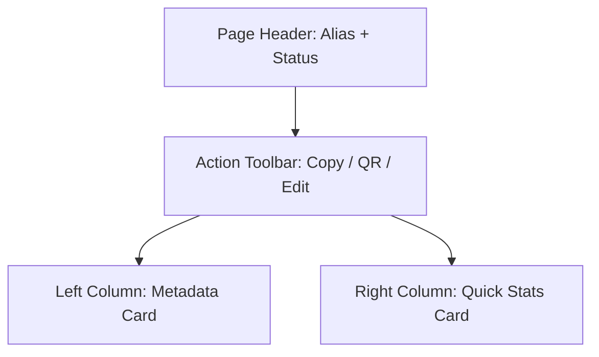

# FEATURE DESIGN DOCUMENT: Smart Link Details (Story 1.3)

## 1. Executive Summary
The Smart Link Details page provides users with a comprehensive view of a single Smart Link. It acts as the central hub for link inspection, displaying metadata, active configuration rules (password, expiration), and a high-level summary of performance (total clicks). It serves as the gateway to deeper actions such as editing, deleting, or viewing full analytics.

## 2. Feature Overview
This feature introduces a new UI view (`/links/:alias` or `/links/:id`) and the accompanying API endpoints to fetch a single link's detailed profile. It will display a visually rich summary card of the link, a QR code generator, and a quick-action toolbar.

## 3. Problem Statement
Currently, users can create and list Smart Links, but they cannot click into a specific link to view its full configuration or access link-specific operations (like downloading a QR code or seeing when it expires). Without a dedicated details page, the platform lacks depth and context for individual link management.

## 4. Product Goals
- Provide a beautiful, highly readable overview of a Smart Link's configuration.
- Enable quick operational actions (Copy, Open, Generate QR Code).
- Establish the navigational anchor for future Edit and Analytics tabs.

## 5. Success Metrics
- **Load Time:** Page renders in < 500ms (leveraging React Query caching from the dashboard where possible).
- **Action Engagement:** 80% of visits result in a "Copy Link" or "View QR" action.

## 6. Product Vision
LinkForge aims to treat every URL as a first-class asset. The Details page reflects this by presenting the link not just as a string, but as a rich object with a lifecycle, security rules, and engagement metrics.

## 7. User Personas
- **Marketers:** Need to quickly grab the short URL and its QR code for a print campaign.
- **Support Engineers:** Need to verify exactly where a link is routing and if it is protected by a password.

## 8. User Stories
- As a user, I want to click on a link in the dashboard to see its full details.
- As a user, I want to see a summary of how many clicks my link has received.
- As a user, I want to know at a glance if my link is active, expired, or disabled.
- As a user, I want to download a QR code for my Smart Link.

## 9. Functional Requirements
- Fetch and display link details using the link `alias` or `id`.
- Display: Alias, Destination URL, Full Short URL, Tags, Status, Created Date, Expiration Date.
- Indicate if the link is password protected (do NOT display the password).
- Display a high-level click counter (`clicks`).
- Provide a "Copy URL" button.
- Provide a "Generate QR Code" modal/view.

## 10. Non-Functional Requirements
- **Responsive:** The layout must adapt gracefully to mobile devices, stacking metadata vertically.
- **Accessibility:** Ensure all icons (copy, QR) have aria-labels. Focus states must be distinct.

## 11. Business Rules
- If a link has passed its `expiresAt` date, the UI must strictly reflect the status as `EXPIRED`, regardless of the database enum state (unless it is explicitly `DISABLED`).
- The `passwordHash` must NEVER be transmitted to the frontend.

## 12. Domain Considerations
- The identity of a link on the frontend can be represented by its `alias` rather than its UUID to create readable URLs (e.g., `/dashboard/links/my-campaign`).
- We must handle `Alias Not Found` gracefully, as aliases can potentially be changed (in future stories).

## 13. Smart Link Details UX
- **Header:** Large, prominent display of the alias and a status badge.
- **Action Bar:** Primary buttons for Copy and Share.
- **Grid Layout:** A 2-column grid on desktop (Metadata on left, Quick Stats/QR on right).

## 14. Page Layout


## 15. Information Hierarchy
1. **Primary:** Short URL and Copy Button.
2. **Secondary:** Destination URL and Status (Active/Expired).
3. **Tertiary:** Tags, Creation Date, Expiration Date, Security (Password).

## 16. Quick Actions
- **Copy:** Copies the full short URL to the clipboard. Shows a temporary "Copied!" tooltip.
- **Visit:** Opens the short URL in a new tab.
- **QR Code:** Opens a modal containing a canvas-rendered QR code with a download button.

## 17. Metadata Display
| Field | UI Presentation |
|-------|-----------------|
| Destination | Truncated if > 60 chars. Clickable external link icon. |
| Expiration | Formatted date (e.g., `Oct 24, 2024, 12:00 PM`) or "Never". |
| Security | "Password Protected" with a Lock icon, or "Public" with a Globe icon. |
| Tags | Pill badges. |

## 18. Statistics Summary (without full analytics)
- A simple, large numeric display representing the `clicks` column from the database.
- *Note:* Detailed timeseries analytics will be handled in a separate epic. This is just a lifetime counter.

## 19. API Design
**GET /api/v1/links/:alias**

Response:
```json
{
  "success": true,
  "data": {
    "id": "uuid",
    "alias": "my-campaign",
    "shortUrl": "https://lnk.fg/my-campaign",
    "destinationUrl": "https://example.com/very-long-url...",
    "hasPassword": true,
    "expiresAt": null,
    "status": "ACTIVE",
    "tags": ["promo"],
    "createdAt": "2024-05-01T12:00:00Z",
    "clicks": 142
  }
}
```

## 20. Backend Design
- **Route:** `GET /:alias` (Note: Must be careful to avoid collision with standard `GET /` query routes. Alias should be a path param).
- **Controller:** Validates alias format, invokes service.
- **Service:** Fetches from repository. Applies expiration logic to `status`. Maps `passwordHash` to `hasPassword` boolean.
- **Repository:** Uses `prisma.smartLink.findUnique({ where: { alias } })`.

## 21. Frontend Design
- **Route:** `/links/:alias`
- **Hook:** `useGetLink(alias: string)` using TanStack Query.
- **Components:** 
  - `LinkDetailsPage.tsx`
  - `LinkMetadataCard.tsx`
  - `LinkQuickStats.tsx`
  - `QRCodeModal.tsx` (using a library like `qrcode.react`)

## 22. Database Considerations
- Ensure `alias` has a unique index (already present in schema: `@unique @db.VarChar(50)`).
- We will need to add a `clicks` field to the `SmartLink` model. Currently, the schema does not have a `clicks` counter.

## 23. Validation Rules
- **Alias Path Param:** Must match the regex `^[a-zA-Z0-9-]+$` to prevent injection or invalid lookups. Max length 50.

## 24. Error Handling
- **404 Not Found:** If the alias does not exist, return a clean 404 response.
- **Frontend:** Render a "Link Not Found" empty state with a button to return to the Dashboard.

## 25. Empty States
- Not strictly applicable to the Details page (a link either exists or it doesn't). 
- If `tags` are empty, display "No tags applied".

## 26. Loading States
- Render a Skeleton page mimicking the two-column grid.
- Keep the Page Header title as a shimmering block until data resolves.

## 27. Security Review
- **IDOR Prevention:** Ensure the user fetching the link has the right to view it. *(Assumption: LinkForge currently operates as a single-tenant or no-auth prototype. In a multi-tenant SaaS, we MUST verify `userId` matches the link's owner).*
- **Data Sanitization:** Password hashes are strictly omitted from the API response payload.

## 28. Performance Review
- Fetching by unique indexed `alias` is an `O(1)` index lookup. The query will execute in < 5ms.

## 29. Scalability Strategy
- The `clicks` counter in the `SmartLink` table is sufficient for now. 
- *Future consideration:* High-traffic links might cause row lock contention if `clicks` are incremented synchronously. We will eventually move click tracking to Redis or an append-only analytics table.

## 30. Logging Strategy
- Log `404` lookups as `WARN` if the frequency spikes (could indicate enumeration attacks).

## 31. Monitoring Strategy
- Track latency of `GET /api/v1/links/:alias`.
- Monitor the usage of the "Generate QR Code" feature via frontend telemetry to judge feature value.

## 32. Testing Strategy
- **Backend:** Unit test the service to ensure `hasPassword` evaluates correctly and hashes are never returned.
- **Frontend:** Component test the `LinkMetadataCard` to ensure it renders "Expired" when the date has passed.

## 33. Risks
- Adding a `clicks` column to the `SmartLink` table requires a Prisma migration.
- Using `alias` in the frontend URL (`/links/:alias`) is great for UX, but if an alias is edited/changed in the future, the old URL will break. (Acceptable risk for now).

## 34. Architecture Decision Records (ADR)
- **ADR-003: Identifier for Link Details Route**
  - *Decision:* Use `alias` instead of UUID for the frontend route (`/links/:alias`).
  - *Justification:* Improves user readability and sharing of management URLs.

## 35. Open Questions
- *Question:* Should we implement the `clicks` counter migration in this story, or wait for the Analytics epic?
  - *Recommendation:* Add a simple `Int @default(0)` clicks column now to satisfy the "Quick Stats" UI requirement, and build robust analytics later.

## 36. Staff Engineer Design Review
The design elegantly separates the metadata view from complex analytics. The decision to use `alias` for routing is sound. We will proceed with adding the `clicks` column to the Prisma schema during implementation to support the Quick Stats card. The integration of `qrcode.react` will cleanly solve the QR requirement without backend canvas rendering.

---

## Implementation Readiness Checklist
- [ ] Prisma schema updated to include `clicks Int @default(0)`.
- [ ] Backend endpoint `GET /api/v1/links/:alias` validated.
- [ ] Frontend route `/links/:alias` configured.
- [ ] Frontend components designed (Metadata, QR Modal).
- [ ] QR Code library chosen (e.g., `qrcode.react`).
