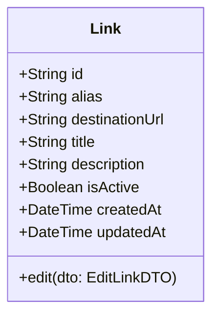
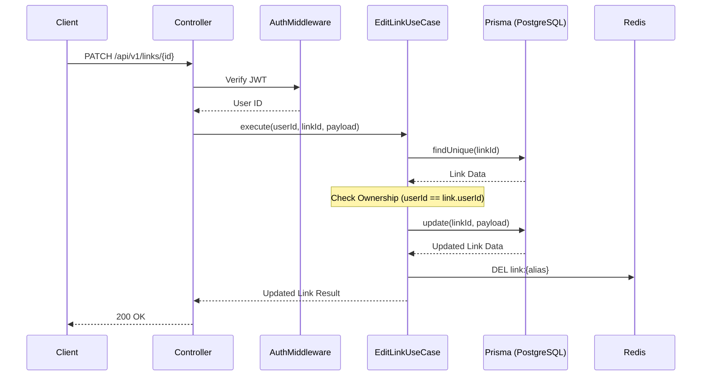

# Feature Design Document: Edit Smart Link

## Product Decision: Custom Alias Editability

Before delving into the feature design, we must address a critical product decision: Should a Custom Alias be editable after a Smart Link is created?

### Option A: Editable
**Pros:**
- **Flexibility:** Users can correct typos made during creation without having to delete and recreate the link.
- **Repurposing:** Users can repurpose an existing link (and its analytics) for a slightly different campaign by changing the alias.

**Cons:**
- **Broken Links:** Changing the alias immediately breaks all existing distributed links. Anyone clicking the old link will get a 404.
- **Reclamation Risks:** If an alias is freed up, another user could claim it, leading to link hijacking where old traffic is redirected to a new, potentially malicious, destination.
- **Architectural Complexity:** Requires complex tombstoning or alias-history tracking if we want to provide fallback redirects or prevent immediate reuse.

### Option B: Immutable (Non-editable)
**Pros:**
- **Link Permanence:** Guarantees that once a link is shared, it will continue to work. This is the core trust metric for a link management platform.
- **Simplicity:** Simpler database constraints (alias as a unique, immutable index) and straightforward request routing.
- **Security:** Eliminates the risk of alias hijacking or accidental traffic misdirection due to alias changes.

**Cons:**
- **Inconvenience on Typos:** Users must delete the erroneous link and create a new one if they make a mistake.
- **Analytics Separation:** If a user wants to "rename" a link, they lose the accumulated analytics of the old link since they must create a new one.

### Final Recommendation
**Option B: Immutable is the recommended approach.**

*Engineering Trade-offs:* The engineering cost of handling mutable aliases (tombstones, redirection loops, caching invalidations on edge networks) far outweighs the UX benefit of fixing typos.
*Product Perspective:* Trust is paramount. A user must trust that a LinkForge link will always resolve correctly. Breaking distributed links violates this trust. If a user needs a new alias, the correct workflow is to create a new Smart Link and archive/delete the old one. The original alias acts as the primary key from a user perspective.

---

## 1. Executive Summary
The Edit Smart Link feature allows users to modify the configuration of an existing Smart Link, including its destination URL, metadata (title, tags, description), and status (active/inactive). This feature is essential for long-term link management, enabling users to update destinations for ongoing campaigns without having to distribute a new short link.

## 2. Feature Overview
Users will access the Edit form via the Smart Links Dashboard or Link Details page. The interface will populate with the link's current data. Users can modify allowable fields and save the changes. The system will validate the new data, update the record, and immediately invalidate necessary caches to ensure real-time redirection updates.

## 3. Problem Statement
Links are often created for campaigns or resources whose destinations change over time (e.g., a "latest-webinar" link). If users cannot edit the destination URL of a Smart Link, they are forced to generate and distribute new links every time the underlying content moves, which is highly inefficient and loses historical analytics context.

## 4. Product Goals
- Allow users to update the destination URL of an existing Smart Link seamlessly.
- Allow users to manage link metadata (tags, title) for better organization.
- Ensure that edits are propagated globally with minimal latency.
- Prevent modification of immutable fields (like the alias) to preserve system integrity.

## 5. Success Metrics
- **Edit Success Rate:** > 99% of edit attempts complete without errors.
- **Cache Invalidation Latency:** < 50ms from database update to edge cache invalidation.
- **User Adoption:** > 20% of active users utilize the edit feature monthly.
- **Support Tickets:** < 1% of support tickets related to "broken links after editing".

## 6. Product Vision
LinkForge aims to be a dynamic traffic routing engine, not just a static link shortener. The ability to fluidly edit link destinations while maintaining the same point of entry (the alias) is a foundational capability for this vision.

## 7. User Personas
- **Marketing Manager (Sarah):** Needs to update the destination of a promotional link from the "Spring Sale" page to the "Summer Sale" page without changing the printed materials that have the QR code/shortlink.
- **Content Creator (Alex):** Wants to update the tags on older links to fit a new organizational schema.
- **System Administrator (David):** Needs to temporarily disable a link that is pointing to a compromised external site.

## 8. User Stories
- As a user, I want to edit the destination URL of my Smart Link so I can redirect traffic to a new page without changing the short link.
- As a user, I want to update the title and tags of my Smart Link so I can keep my dashboard organized.
- As a user, I want to toggle the active status of my Smart Link so I can temporarily pause traffic without deleting the link.
- As a user, I want to see validation errors if I enter an invalid destination URL during editing.

## 9. Functional Requirements
- The system must provide an API endpoint to update a link resource (`PUT` or `PATCH` `/api/v1/links/:id`).
- The system must validate the new destination URL format and safety.
- The system must check user authorization before allowing edits.
- The system must update the modified fields in the PostgreSQL database.
- The system must invalidate the specific link's cache in Redis upon a successful update.
- The UI must pre-fill the edit form with the current link data.

## 10. Non-Functional Requirements
- **Performance:** The API response time for the edit operation must be under 200ms (p95).
- **Consistency:** The updated destination must be reflected in the redirection engine immediately (read-after-write consistency for the owner, eventual consistency < 1s for edge redirects).
- **Security:** Must protect against CSRF and IDOR vulnerabilities.
- **Auditability:** Edits should trigger an event for audit logging (who edited what, and when).

## 11. Business Rules
- Only the creator/owner of the link (or an organization admin) can edit the link.
- The destination URL must not resolve to an internal LinkForge domain (preventing redirect loops).
- A link that has been flagged as malicious by the automated security scanner cannot have its destination edited to another unverified domain without manual review.

## 12. Editable vs Non-editable Fields
| Field | Editable? | Reason |
| :--- | :--- | :--- |
| `id` | No | Primary Key |
| `alias` | No | Link Permanence (See Product Decision) |
| `destinationUrl`| Yes | Core value proposition of dynamic links |
| `title` | Yes | Organizational metadata |
| `description` | Yes | Organizational metadata |
| `tags` | Yes | Organizational metadata |
| `isActive` | Yes | Allows pausing/resuming traffic |
| `createdAt` | No | Audit integrity |

## 13. Domain Model Impact
The `Link` entity requires minimal changes, primarily ensuring the `updatedAt` timestamp is properly managed by the ORM (Prisma).



## 14. User Flow
1. User navigates to the Smart Links Dashboard.
2. User clicks the "Edit" action (pencil icon) next to a specific link.
3. A modal or dedicated page opens, populated with current link data.
4. User modifies the `destinationUrl` and `tags`.
5. User clicks "Save Changes".
6. Frontend sends a `PATCH` request to the backend.
7. Backend validates, updates DB, invalidates cache, returns success.
8. Frontend displays success toast and updates the local state/cache (TanStack Query).
9. Modal closes.

## 15. UX Design
- **Entry Point:** A clear, recognizable "Edit" icon in the actions menu of the link table/card.
- **Interaction:** A slide-out panel (drawer) or a focused modal to keep the user in the context of their dashboard.
- **Visual Cues:**
  - The `alias` field should be visible but styled as `disabled` (greyed out) with a tooltip explaining why it cannot be changed.
  - Required fields (Destination URL) clearly marked.
- **Feedback:** Real-time inline validation for the URL format. Loading state on the "Save" button during submission.

## 16. Form Design
- **Destination URL:** `type="url"`, placeholder="https://...", required.
- **Title:** `type="text"`, optional, max length 100.
- **Alias:** `type="text"`, disabled, read-only.
- **Tags:** Multi-select input component allowing creation of new tags or selection of existing ones.
- **Status:** Toggle switch (Active/Inactive).

## 17. Validation Rules (Zod Schema)
```typescript
// Conceptual Zod Schema (Not implementation code, just design definition)
const EditLinkSchema = z.object({
  destinationUrl: z.string().url("Must be a valid URL").max(2048, "URL too long").optional(),
  title: z.string().max(100, "Title must be under 100 characters").optional().nullable(),
  description: z.string().max(500, "Description must be under 500 characters").optional().nullable(),
  isActive: z.boolean().optional(),
  tags: z.array(z.string().max(30)).max(10, "Maximum 10 tags allowed").optional(),
}).refine(data => Object.keys(data).length > 0, {
  message: "At least one field must be provided for update"
});
```

## 18. API Design
**Endpoint:** `PATCH /api/v1/links/:id`
**Description:** Partially updates an existing Smart Link.

**Request Header:**
`Authorization: Bearer <token>`

**Request Body (application/json):**
Any combination of the editable fields defined in the schema.
```json
{
  "destinationUrl": "https://example.com/new-destination",
  "tags": ["marketing", "q3-campaign"]
}
```

**Response (200 OK):**
```json
{
  "status": "success",
  "data": {
    "id": "link_123abc",
    "alias": "summer-sale",
    "destinationUrl": "https://example.com/new-destination",
    "title": "Summer Sale 2024",
    "tags": ["marketing", "q3-campaign"],
    "isActive": true,
    "updatedAt": "2026-07-12T10:30:00Z"
  }
}
```

**Responses (Errors):**
- `400 Bad Request`: Validation failure.
- `401 Unauthorized`: Missing or invalid token.
- `403 Forbidden`: User does not own the link.
- `404 Not Found`: Link ID does not exist.

## 19. Backend Design
**Clean Architecture Layers:**
- **Controller (`LinkController`):** Extracts ID and body, passes to Use Case. Handles HTTP responses.
- **Use Case (`EditLinkUseCase`):**
  1. Validates ID and DTO.
  2. Fetches existing link to verify ownership (Authorization).
  3. Applies changes.
  4. Calls Repository to save.
  5. Triggers `LinkUpdatedEvent`.
- **Repository (`LinkRepository`):** Executes the Prisma `update` query.
- **Event Handler (`CacheInvalidationHandler`):** Listens for `LinkUpdatedEvent` and executes `redis.del("link:{alias}")`.



## 20. Frontend Design
- **State Management:** Use TanStack Query's `useMutation`.
- **Cache Updates:** On successful mutation, use `queryClient.setQueryData` to optimistically update the specific link in the dashboard list cache, avoiding a full refetch of the list if possible, or trigger a targeted invalidation.
- **Form Handling:** React Hook Form bound with a Zod resolver using the schema defined in Section 17.
- **Components:** Reuse existing generic `Input`, `Toggle`, and `Button` components from the UI library.

## 21. Database Considerations
- Ensure the `updatedAt` field is configured with `@updatedAt` in the Prisma schema.
- No new indexes are required for this specific feature.
- Use atomic updates where appropriate, though a standard SQL `UPDATE` by primary key is sufficient and performant here.

## 22. Error Handling
- **Concurrent Edits:** If two users (in a team scenario) edit simultaneously, standard "last write wins" is acceptable for this domain. No complex optimistic concurrency control (ETags) is required for MVP.
- **Database Unavailable:** Return standard `503 Service Unavailable`.
- **Cache Deletion Failure:** If the DB updates but Redis deletion fails, we risk serving stale redirects.
  - *Mitigation:* Wrap DB update and cache invalidation in a resilient pattern, or ensure Redis TTLs are reasonably short as a fallback. Alert on cache deletion failures.

## 23. Security Review
- **IDOR (Insecure Direct Object Reference):** The core security risk. The backend MUST verify that the `userId` extracted from the JWT owns the `linkId` provided in the path before performing the update.
- **SSRF (Server-Side Request Forgery) Prevention:** If the backend performs health checks on the new `destinationUrl`, ensure those checks cannot hit internal AWS/infrastructure endpoints (e.g., block `169.254.169.254`, `localhost`, etc.).
- **XSS:** Ensure any metadata (title, description) is properly sanitized when rendered in the frontend dashboard.

## 24. Performance Review
- The database `UPDATE` by Primary Key (`id`) is an $O(1)$ operation (given the index).
- Cache invalidation (Redis `DEL`) is an $O(1)$ operation.
- Overall API response time is expected to be dominated by network latency and DB connection acquisition, well within the 200ms budget.

## 25. Scalability Strategy
- The API is stateless, allowing horizontal scaling of the Express/Node.js application servers.
- Redis cache invalidation scales well. If multi-region, cache invalidation must be broadcast to all regional caches via a Pub/Sub mechanism.

## 26. Logging Strategy
- Log all successful edits at `INFO` level, including `userId`, `linkId`, and the fields that were modified (do not log the actual new destination URL in standard access logs for privacy, only in audit logs).
- Log authorization failures at `WARN` level.
- Log database or cache errors at `ERROR` level with stack traces.

## 27. Monitoring Strategy
- Track the latency of the `PATCH /links/:id` endpoint.
- Monitor for spikes in `403 Forbidden` responses, which could indicate a script attempting to guess link IDs.
- Monitor cache invalidation success rates.

## 28. Testing Strategy
- **Unit Tests:**
  - `EditLinkUseCase`: Verify authorization logic, verify correct fields are passed to repository, verify event emission.
  - Zod Schema: Verify valid and invalid payloads.
- **Integration Tests:**
  - API endpoint: Send valid/invalid tokens, test IDOR (User A modifying User B's link), verify DB state changes.
- **E2E Tests (Playwright):**
  - Log in, navigate to dashboard, open edit modal, change URL, save, verify UI updates, navigate to the alias and verify the redirect goes to the new destination.

## 29. Risks
- **Risk:** Stale Cache serving old destinations.
  - **Mitigation:** Ensure robust error handling around the Redis `DEL` command. Implement a background reconciliation worker if absolute consistency is mandated later.
- **Risk:** Malicious destination URLs.
  - **Mitigation:** Integrate with a safe browsing API (e.g., Google Web Risk) synchronously during the edit request or asynchronously via BullMQ shortly after.

## 30. ADRs (Architecture Decision Records)
- **ADR-004:** Link Aliases are Immutable. (Documented in "Product Decision" section of this document).

## 31. Open Questions
- Do we want to support Webhook notifications when a link is edited? (Assumption for MVP: No. Push to backlog).
- Should we keep a historical log of all destination URLs a link has pointed to? (Assumption: No, unless requested for enterprise compliance later).

## 32. Staff Engineer Review
- **Architecture Alignment:** The design aligns with Clean Architecture. Utilizing an event-driven approach for cache invalidation (`LinkUpdatedEvent`) decouples the core domain from infrastructure concerns.
- **Security:** The emphasis on IDOR prevention is critical and correctly identified.
- **Recommendation:** Approved for implementation. Ensure TanStack Query optimistic updates are implemented carefully to handle rollback on API failure.

---

## Implementation Readiness Checklist
- [x] Product requirements clearly defined.
- [x] Important product decisions resolved (Alias Immutability).
- [x] API contract designed.
- [x] Security considerations addressed.
- [x] UI/UX flow established.
- [ ] Backend developer assigned.
- [ ] Frontend developer assigned.
