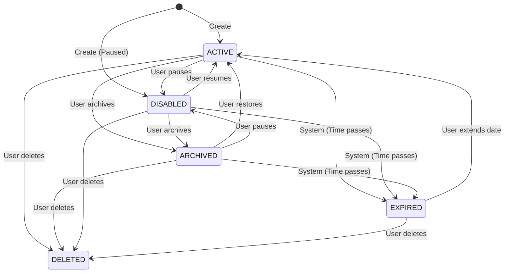

# Feature Design Document: Smart Link Lifecycle Management

## 1. Executive Summary
The Smart Link Lifecycle Management feature introduces a formal state machine to govern the various states a Smart Link can inhabit throughout its existence. This document designs the "Archive" and "Restore" capabilities, formalizes all status transitions (Active, Disabled, Archived, Expired), and establishes the business rules that maintain system integrity. This ensures users can organize their workspace by archiving old links while preserving historical analytics, and clearly defines how link routing behaves in each state.

## 2. Feature Overview
This feature implements robust lifecycle management. Users will be able to Archive links to remove them from their primary dashboard view without deleting their analytics data. They can view archived links in a separate view and Restore them to the active dashboard. The backend will enforce a strict state machine to prevent illegal transitions and ensure that the routing engine correctly handles requests based on the current lifecycle state.

## 3. Problem Statement
As users generate hundreds or thousands of Smart Links for various campaigns, their main dashboard becomes cluttered and unmanageable. Currently, the only way to remove a link is to delete it, which destroys valuable historical click data and permanently breaks the link. Users need a way to organize and hide obsolete links (Archiving) without losing data, and the system needs a unified, predictable model for handling links in different states (Active, Paused, Expired, Archived).

## 4. Business Goals
- Improve user retention by providing essential organizational tools for power users.
- Preserve historical analytics data by discouraging hard deletions.
- Standardize the routing behavior across all edge cases (what happens when an archived link is clicked vs. an expired link).
- Lay the architectural foundation for permanent deletion (Story 1.6) and compliance features (data retention policies).

## 5. Success Metrics
- **Adoption:** > 30% of users with over 50 links utilize the Archive feature.
- **Data Preservation:** Decrease in the rate of link deletions by 40%.
- **System Stability:** 0 incidents of broken routing due to invalid state transitions.
- **Performance:** Filtering by state (e.g., viewing only Active links) remains under 100ms response time.

## 6. Product Vision
LinkForge is not just a link creator; it is a comprehensive asset management platform. Just as documents in a workspace have a lifecycle (draft, published, archived), Smart Links are living assets. Providing a clear, reliable lifecycle management system is crucial for enterprise-grade scalability and user trust.

## 7. User Personas
- **Marketing Manager (Sarah):** Runs seasonal campaigns. Wants to archive last year's "Summer Sale" links so they don't clutter the dashboard, but still wants the links to route successfully if someone clicks an old email, and wants to keep the analytics.
- **System Administrator (David):** Needs to enforce that once a link is "Expired", it cannot be made "Active" again without explicitly extending the expiration date.
- **Content Creator (Alex):** Accidentally archived a link and needs to quickly restore it to the main view.

## 8. User Stories
- As a user, I want to archive an active link so that it is hidden from my main dashboard but still routes traffic.
- As a user, I want to view a list of my archived links so I can review historical campaigns.
- As a user, I want to restore an archived link back to my active dashboard.
- As a system, I want to automatically transition a link to the "Expired" state when its expiration date passes, stopping all traffic routing.

## 9. Functional Requirements
- The system must provide API endpoints to change a link's state (`POST /api/v1/links/:id/archive`, `POST /api/v1/links/:id/restore`).
- The Dashboard API (`GET /api/v1/links`) must filter out `ARCHIVED` links by default unless explicitly requested via a query parameter (e.g., `?state=ARCHIVED`).
- The routing engine must continue to route `ARCHIVED` links, but return a 404/410 for `EXPIRED` or `DISABLED` links.
- The system must prevent invalid state transitions (e.g., Restoring a link that is already Active).

## 10. Non-Functional Requirements
- **Auditability:** Every state transition must update the `updatedAt` timestamp and be loggable for future audit trails.
- **Performance:** State transitions must invalidate edge caches immediately (< 50ms) if the transition affects routing (e.g., `ACTIVE` -> `DISABLED`).
- **Consistency:** The state machine rules must be enforced exclusively on the backend to prevent API manipulation.

## 11. Lifecycle Model
We will use a single `status` column (Enum/String) in the database to represent the lifecycle state.

**States:**
1. **`ACTIVE`:** The link is live, visible on the dashboard, and routes traffic.
2. **`DISABLED`:** The link is manually paused by the user. Visible on the dashboard, but does **not** route traffic.
3. **`ARCHIVED`:** The link is hidden from the main dashboard. It **still routes traffic** (to preserve old distributed links).
4. **`EXPIRED`:** The link's `expiresAt` date has passed. It does **not** route traffic.
5. **`DELETED`:** (Out of scope for this story, but planned).

## 12. State Machine



## 13. Transition Rules
| Current State | Action | Target State | Routing Impact | Dashboard Visibility |
| :--- | :--- | :--- | :--- | :--- |
| `ACTIVE` | Archive | `ARCHIVED` | Unchanged (Routes) | Hidden |
| `ACTIVE` | Disable | `DISABLED` | Stops routing | Visible |
| `DISABLED` | Resume | `ACTIVE` | Starts routing | Visible |
| `DISABLED` | Archive | `ARCHIVED` | Unchanged (Stopped)| Hidden |
| `ARCHIVED` | Restore | `ACTIVE` | Unchanged (Routes) | Visible |
| `ARCHIVED` | Disable | `DISABLED` | Stops routing | Visible |
| `*` | Expire | `EXPIRED` | Stops routing | Visible (as Expired) |

## 14. Business Rules
- **Archive Routing:** Archiving a link is purely an organizational action. Archived links MUST continue to route traffic to prevent breaking existing user shares.
- **Expiration Precedence:** The `EXPIRED` state takes precedence over all other states if `expiresAt < now()`. The routing engine must check expiration regardless of the stored `status` string, or a cron/trigger must keep the DB state perfectly synced. (Recommendation: Check on the fly during routing + lazy update).
- **Idempotency:** Calling Archive on an already Archived link should return 200 OK without side effects.

## 15. Domain Impact
The `SmartLink` model's `status` field needs to be strictly typed and managed.

```typescript
type LinkStatus = 'ACTIVE' | 'DISABLED' | 'ARCHIVED' | 'EXPIRED' | 'DELETED';
```

## 16. API Design
Instead of generic `PATCH` requests for lifecycle events, we use explicit RPC-style REST endpoints to capture the specific intent and simplify backend state machine logic.

**Archive Link:**
`POST /api/v1/links/:id/archive`
- Response: 200 OK
- Cache Invalidation: None required (routing behavior doesn't change).

**Restore Link:**
`POST /api/v1/links/:id/restore`
- Response: 200 OK
- Cache Invalidation: None required.

**Update List Links API:**
`GET /api/v1/links?status=ARCHIVED`
- Default behavior if `status` is omitted: Return `ACTIVE`, `DISABLED`, `EXPIRED`. Exclude `ARCHIVED` and `DELETED`.

## 17. UX Design
- **Dashboard:**
  - Add a "Status" filter pill/tab: "Active", "Archived".
  - In the "More Actions" (three dots) menu on a table row, add "Archive" (for active links) and "Restore" (for archived links).
- **Visual Indicators:**
  - Archived links should have a specific grayed-out styling or a distinct badge to indicate their state if viewed in a mixed list.
- **Confirmation:**
  - Archiving: Show a brief toast "Link archived. It will continue to route traffic."
  - Restoring: Show a brief toast "Link restored to dashboard."

## 18. Backend Design
- **State Machine Engine:** Implement a utility or class `LinkStateMachine` that takes `(currentState, action)` and returns `newState` or throws an `InvalidTransitionError`.
- **Use Cases:**
  - `ArchiveLinkUseCase`
  - `RestoreLinkUseCase`
- **Controller:** `LifecycleController` to handle the specific action endpoints.

## 19. Frontend Design
- **API Hooks:**
  - `useArchiveLink(id)`
  - `useRestoreLink(id)`
- **Optimistic UI:** When archiving, immediately remove the item from the local TanStack Query cache list for `['links', { status: 'DEFAULT' }]` to make the UI feel instant.

## 20. Database Considerations
- The `status` column is currently a `VARCHAR(20)` with default `"ACTIVE"`. This is sufficient, but should be strictly constrained at the application level via the `LinkStatus` type.
- The existing Prisma schema supports this without structural migrations, ensuring fast delivery.

## 21. Validation Rules
- The API must reject `POST /archive` if the link is already `DELETED`.
- The API must verify user ownership (IDOR protection) before any state transition.

## 22. Error Handling
- `400 Bad Request`: If the transition is invalid (e.g., trying to restore an active link).
- `403 Forbidden`: User does not own the link.
- `404 Not Found`: Link ID does not exist.

## 23. Security
- Enforce strict authorization checks. Lifecycle modifications are destructive/disruptive actions and must be strictly bound to the link owner or workspace admin.

## 24. Performance
- Archiving/Restoring are simple `$set` updates in SQL and are highly performant.
- To maintain dashboard query performance, ensure the database index on `(userId, status, createdAt)` is optimized for filtering out archived links efficiently.

## 25. Scalability
- The state machine logic is completely stateless on the Node.js instances, scaling horizontally without bottlenecks.

## 26. Logging
- Log all lifecycle transitions in the format: `[LIFECYCLE] Link {id} transitioned from {oldState} to {newState} by User {userId}`.

## 27. Monitoring
- Track the number of `InvalidTransitionError` occurrences. A high rate indicates a UI bug where disabled buttons are being bypassed or concurrent modification issues.

## 28. Testing Strategy
- **Unit Tests:** Extensively test the `LinkStateMachine` with every possible combination of `(state, action)` to ensure exact adherence to the transition matrix.
- **Integration Tests:** Verify that `GET /links` correctly hides `ARCHIVED` links by default.
- **E2E Tests:** Archive a link -> verify it disappears from dashboard -> navigate to the archived tab -> restore the link -> verify it reappears on the main dashboard. Verify the actual shortened link still redirects correctly while in the ARCHIVED state.

## 29. Risks
- **Risk:** Users confusing "Archive" with "Disable", assuming Archiving stops traffic.
  - **Mitigation:** Clear UX copy on the Archive confirmation or tooltip explicitly stating "Archived links continue to route traffic."
- **Risk:** Expiration logic becoming out of sync with DB status.
  - **Mitigation:** The routing engine MUST evaluate `expiresAt < new Date()` independently of the `status` field. If expired, it should trigger an async background job to update the DB `status` to `EXPIRED` to eventually consistent sync the database.

## 30. ADRs
- **ADR-005:** Explicit RPC Endpoints for Lifecycle Actions.
  - *Decision:* Use `POST /:id/archive` instead of `PATCH /:id { status: 'ARCHIVED' }`.
  - *Rationale:* Lifecycle transitions often trigger complex side effects (webhooks, audit logs, billing changes). Intent-revealing endpoints make the backend architecture cleaner and more maintainable than a massive `if/else` block inside a generic update endpoint.

## 31. Open Questions
- Do we want to automatically archive links that haven't received a click in > 1 year to improve system performance? (Recommendation: Push to backlog as an Enterprise feature).

## 32. Staff Engineer Review
- **Architecture:** The state machine design is solid. Extracting it from the generic edit flow (ADR-005) prevents the `PATCH` endpoint from becoming a god-function.
- **Data Integrity:** The routing engine's handling of `EXPIRED` vs `ARCHIVED` is well-defined and prevents regressions.
- **Approval:** Approved for implementation. Ensure the TanStack Query cache invalidation strategy explicitly handles moving items between the "Active" and "Archived" list views to prevent UI flicker.

---

## Implementation Readiness Checklist
- [x] State machine fully mapped.
- [x] Routing behaviors defined for every state.
- [x] API contracts established.
- [x] UX strategy for hiding/showing archived links defined.
- [ ] Backend developer assigned.
- [ ] Frontend developer assigned.
