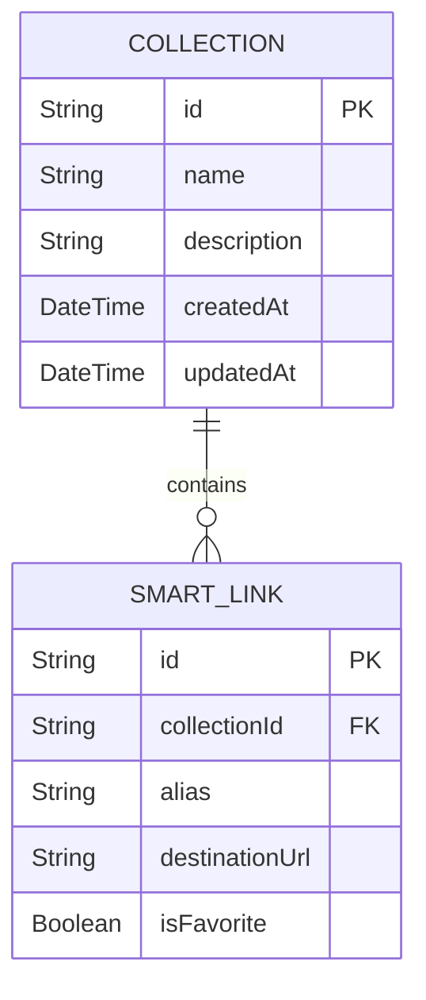

# Feature Design Document: Smart Link Collections

## 1. Executive Summary
The Smart Link Collections feature (Story 1.8) introduces structural organization to LinkForge. Collections act as primary folders, allowing users to group Smart Links logically by project, client, or purpose (e.g., "Marketing", "Personal", "Q3 Campaigns"). This feature addresses the cognitive overload users experience as their link volume scales, providing a clean, hierarchical way to manage links alongside the existing tagging system.

## 2. Feature Overview
Users can create, rename, and delete Collections. Smart Links can be assigned to a specific Collection. The Dashboard sidebar will display these Collections, allowing users to filter their active view by selecting a Collection.

## 3. Problem Statement
As users generate hundreds of links, a flat list becomes unmanageable. While tags provide multidimensional filtering, users often desire a primary, mutually exclusive organizational structure (like folders on a computer) to segregate distinct areas of their work or personal life.

## 4. Business Goals
- Increase user retention by offering superior organizational tools.
- Pave the way for future "Workspace/Team" features where entire Collections can be shared with specific team members.
- Reduce time-to-find for active links.

## 5. Success Metrics
- **Adoption:** > 40% of users with over 20 links create at least one Collection.
- **Organization:** > 50% of newly created links are assigned to a Collection within 7 days.
- **Engagement:** Increased interaction with the sidebar navigation.

## 6. Product Vision
LinkForge is an Intelligent Smart Link Management Platform. Collections provide the foundational taxonomy. When combined with tags, favorites, and robust search, LinkForge offers an unparalleled, enterprise-grade organizational experience.

## 7. User Personas
- **Agency Marketer (Power User):** Creates Collections for each distinct client ("Acme Corp", "Globex").
- **Content Creator:** Uses Collections for different platforms ("YouTube Bios", "Instagram Promos").
- **Developer:** Uses Collections for different environments ("Production Auth", "Staging APIs").

## 8. User Stories
- As a user, I want to create a Collection so I can group related links.
- As a user, I want to move a Smart Link into a Collection.
- As a user, I want to rename a Collection if my project name changes.
- As a user, I want to delete a Collection without deleting the links inside it.
- As a user, I want to click a Collection in the sidebar to view only its links.

## 9. Functional Requirements
- **CRUD Collections:** API endpoints to Create, Read, Update, and Delete Collections.
- **Link Assignment:** The `SmartLink` model and `editLink` API must support assigning/updating a `collectionId`.
- **Sidebar UI:** A dedicated section in the layout to list Collections.
- **Dashboard Filtering:** Clicking a Collection filters the dashboard table by `collectionId`.

## 10. Non-Functional Requirements
- **Scalability:** Collections should load quickly, ideally with a count of active links.
- **UX:** Drag-and-drop (future enhancement) should be considered, but manual assignment via dropdown is required for MVP.

---

## Important Product Decisions

### 1. One Collection vs Multiple Collections per Link
**Evaluation:**
- **A. One Collection (1:N):** Acts like a folder. A link lives in exactly one Collection (or is Uncategorized). Easy to understand, maps well to filesystem logic. Simple DB foreign key (`collectionId`).
- **B. Multiple Collections (M:N):** Acts like tags/playlists. Requires a junction table (`LinkCollection`). High query complexity. Redundant with our existing `tags` feature.
- **Recommendation:** **One Collection Only (1:N).** 
To avoid confusing users, Collections will act as strict folders (primary categorization), while Tags will remain the solution for multidimensional categorization.

### 2. Deleting a Collection
**Evaluation:**
- **Delete Smart Links:** Causes catastrophic data loss. Unacceptable.
- **Move to "Uncategorized":** This is the safest and most intuitive behavior.
- **Recommendation:** **Set `collectionId = null` (Uncategorized).** 
When a Collection is deleted, the database should perform a soft cascade (or `ON DELETE SET NULL`), effectively returning all associated links to the "Uncategorized" state.

### 3. System Collections (Favorites, Archived, Recent)
**Evaluation:**
- If Favorites/Archived were actual Collections, a link couldn't belong to the "Work" collection AND be a "Favorite" (due to the 1:N rule). 
- **Recommendation:** **System Collections remain Views/Filters.** 
They should be visually distinct in the UI (e.g., pinned at the top of the sidebar under a "Smart Views" header), but they do not use the `Collection` data model.

---

## 11. Business Rules
- A Collection name must be unique per User/Workspace.
- A Collection name cannot be empty.
- Deleting a Collection does not delete its links.
- Uncategorized is not a physical collection in the DB; it is the state where `collectionId IS NULL`.

## 12. Domain Model Impact



- **New Model:** `Collection`
- **Updated Model:** `SmartLink` (add `collectionId` nullable foreign key).

## 13. Collection Lifecycle
1. **Creation:** User provides a name (e.g., "Marketing").
2. **Usage:** Links are assigned via the Link Creation/Edit form.
3. **Modification:** Name can be updated.
4. **Deletion:** Collection is removed; child links revert to `collectionId = null`.

## 14. Collection Management Workflow
1. User clicks "New Collection" in the sidebar.
2. A small modal prompts for the Collection Name.
3. User submits -> Optimistic UI adds it to the sidebar.
4. User clicks the Collection -> Dashboard filters by `?collectionId=<id>`.

## 15. Smart Link Assignment Workflow
1. User clicks "Edit" on a link.
2. A new dropdown "Collection" appears, listing all available Collections (plus "None/Uncategorized").
3. User selects a Collection and saves.

## 16. UX Design
- **Sidebar Structure:**
  - **Smart Views:** All Links, Favorites, Archived
  - **Collections:** [ + New Collection ]
    - 📁 Marketing
    - 📁 Personal
    - 📁 Client X
- **Dashboard Header:** When a Collection is selected, the Dashboard Title changes to the Collection Name, and a "Collection Settings" (Rename/Delete) menu appears.

## 17. Dashboard Integration
- The `useGetLinks` hook will accept a `collectionId` parameter.
- The Table will hide the "Collection" column if viewing a specific Collection, but may show a "Collection" badge when viewing "All Links".

## 18. API Design

### Collection Endpoints
- `POST /api/v1/collections` - Create
  - Body: `{ "name": "Marketing", "description": "..." }`
- `GET /api/v1/collections` - List all
- `PATCH /api/v1/collections/:id` - Rename
- `DELETE /api/v1/collections/:id` - Delete

### Link Endpoints
- `PATCH /api/v1/links/:id` (Existing edit endpoint will be updated to accept `collectionId`).

## 19. Backend Design
- **New Module:** `collections`
  - `collection.controller.ts`
  - `collection.service.ts`
  - `collection.repository.ts`
  - `collection.schema.ts` (Zod validation)
- **Link Module Updates:** `link.repository.ts` must join or filter by `collectionId`.

## 20. Frontend Design
- **New Context/State:** Consider caching the list of Collections heavily using TanStack Query, as it populates the sidebar and dropdowns everywhere.
- **Components:** `Sidebar.tsx`, `CollectionModal.tsx`, `CollectionSelect.tsx` (for the link form).

## 21. Database Design Considerations
```prisma
model Collection {
  id          String      @id @default(uuid())
  name        String      @db.VarChar(100)
  description String?     @db.VarChar(500)
  createdAt   DateTime    @default(now())
  updatedAt   DateTime    @updatedAt
  
  links       SmartLink[]
}

model SmartLink {
  // ... existing fields ...
  collectionId String?
  collection   Collection? @relation(fields: [collectionId], references: [id], onDelete: SetNull)
}
```
*Note: `onDelete: SetNull` elegantly enforces our business rule of moving links to "Uncategorized" upon Collection deletion.*

## 22. Validation Rules
- **Name:** 1-100 characters. Alphanumeric, spaces, dashes, underscores.
- **Uniqueness:** Must be unique within the current user's workspace context.

## 23. Error Handling
- `409 Conflict`: If attempting to create a collection with a name that already exists.
- `404 Not Found`: If attempting to update/delete a non-existent collection.

## 24. Security Review
- **IDOR Prevention:** Ensure the user attempting to read/update/delete the Collection is the owner of the workspace. (Standard middleware).

## 25. Performance Review
- The sidebar requires fetching all Collections. We should return a lightweight DTO (id, name, linkCount).
- `linkCount` can be heavily optimized using Prisma's `_count` relation.

## 26. Scalability Strategy
- The 1:N relationship scales perfectly.
- Indexing `collectionId` on the `SmartLink` table is critical for fast Dashboard filtering.

## 27. Logging Strategy
- `[INFO] Collection {id} created: {name}`
- `[INFO] Collection {id} deleted. {count} links unassigned.`

## 28. Monitoring Strategy
- Track average links per collection to understand usage behavior.

## 29. Testing Strategy
- **Unit:** Test `onDelete: SetNull` behavior in isolation to ensure no orphaned or deleted links occur.
- **Integration:** Test the `POST` uniqueness constraint.
- **E2E:** Create collection -> Assign link -> Filter dashboard by collection -> Delete collection -> Verify link returns to "All Links".

## 30. Risks
- **Risk:** Sidebar becomes cluttered if a user creates 100+ collections.
  - **Mitigation:** Implement a scrolling overflow area for the Collections list in the UI.

## 31. Architecture Decision Records (ADR)
- **ADR-008: 1:N Collection Relationship**
  - *Context:* Need structural grouping for Links.
  - *Decision:* Links belong to 1 Collection maximum. Collections are distinct from Tags.
  - *Consequences:* Simpler UI, clear mental model for users, efficient queries.

## 32. Open Questions
- Should we allow nested collections (sub-folders)?
  - *Decision:* No, YAGNI. Keep it flat for MVP to maintain UI/UX simplicity.

## 33. Staff Engineer Review
- **Architecture:** The choice of `onDelete: SetNull` natively in the database layer is excellent and prevents application-layer race conditions when deleting a collection.
- **Approval:** Approved for Implementation.

---

## Implementation Readiness Checklist
- [x] Database schema defined (`Collection` model).
- [x] API contract designed.
- [x] UX Sidebar workflow defined.
- [ ] Backend developer assigned.
- [ ] Frontend developer assigned.
