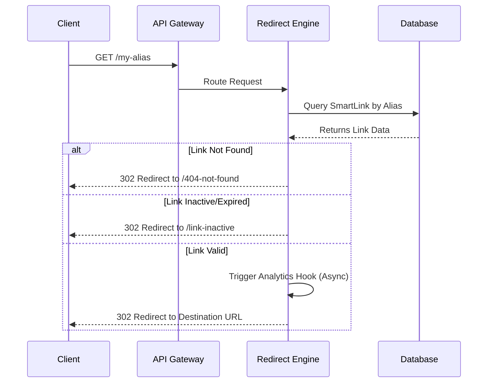

# LINKFORGE — FEATURE DESIGN DOCUMENT (FDD)
**Epic 2:** Redirect Engine  
**Story 2.1:** Smart Redirect Engine  
**Status:** Approved for Implementation  

---

## 1. Executive Summary
The Smart Redirect Engine is the operational core of LinkForge. It is responsible for intercepting a short alias (e.g., `linkforge.com/my-campaign`), looking up the corresponding `SmartLink`, validating its state, and securely routing the user to the final destination URL. This story establishes the baseline pipeline, enabling future expansions like geo-routing, password protection, and advanced analytics.

## 2. Feature Overview
- Intercepts inbound HTTP GET requests to `/:alias`.
- Resolves the alias against the PostgreSQL database.
- Validates the link state (Active vs Disabled vs Archived).
- Safely redirects the client to the target URL.
- Handles edge cases (not found, inactive) with proper error pages.
- Provides asynchronous hooks for future analytics tracking.

## 3. Problem Statement
Users expect generated short links to reliably redirect them to the destination at lightning speed. If the redirect engine is slow, users abandon the link. If it fails silently or returns raw JSON errors, the user experience is ruined. We need an extensible pipeline that serves fast redirects while accommodating complex business rules.

## 4. Business Goals
- Deliver sub-100ms redirect times.
- Ensure 100% analytics capture potential (no permanent client-side caching).
- Provide a smooth, branded user experience for broken/inactive links.

## 5. Success Metrics
- **P95 Latency:** < 50ms for redirect response generation.
- **Cache Hit Ratio:** 0% (Client caching must be disabled to track clicks).
- **Error Rate:** < 0.1% for valid aliases.

## 6. Product Vision
LinkForge is not just a router; it is a traffic control center. The Redirect Engine acts as the gateway where clicks are analyzed, verified against security protocols, and dynamically routed based on custom smart rules.

---

## 7. Redirect Lifecycle
The lifecycle of a redirect request is entirely synchronous for the user, while side effects (like analytics) are deferred.



## 8. Request Flow
1. **Ingress:** Client navigates to the short URL.
2. **Controller:** The `RedirectController` handles the `GET /:alias` request.
3. **Service:** The `RedirectService` attempts alias resolution.
4. **Validation:** Engine confirms the link is active and not expired.
5. **Egress:** Engine responds with an HTTP Redirect header (`Location: <destination>`).

## 9. Redirect Pipeline
The pipeline is designed with a middleware-like pattern to allow future extensibility.
1. **Resolution Step:** Fetch data using the alias.
2. **Gatekeeper Step (State):** Block if `status !== ACTIVE`.
3. **Gatekeeper Step (Time):** Block if `expiresAt < now`.
4. **Gatekeeper Step (Auth):** *Hook for future password checks.*
5. **Analytics Step:** Fire-and-forget message to a message queue or background job.
6. **Terminal Step:** Respond with HTTP redirect.

---

## 10. Functional Requirements
- The system MUST resolve aliases via a `GET /:alias` route.
- The system MUST redirect valid requests to the `destinationUrl`.
- The system MUST NOT redirect requests for `DISABLED` or `ARCHIVED` links.
- The system MUST redirect invalid requests to a frontend error page.
- The system MUST support async hooks to record clicks without blocking the HTTP response.

## 11. Non-Functional Requirements
- **Performance:** Redirects must be fast. Database lookups must use indexed columns.
- **Availability:** The redirect route must not crash under high concurrency.
- **Statelessness:** The engine must be stateless to scale horizontally.

## 12. Business Rules
- **Rule 1:** Links marked as `DISABLED` cannot be used for routing.
- **Rule 2:** Links marked as `ARCHIVED` cannot be used for routing.
- **Rule 3:** Expired links cannot be used for routing.
- **Rule 4:** System routes (e.g., `/api`, `/dashboard`) take precedence over aliases.

## 13. Domain Model
*Relevant subset of `SmartLink` for this feature:*
- `alias` (String, Indexed)
- `destinationUrl` (String)
- `status` (Enum: ACTIVE, DISABLED, ARCHIVED)
- `expiresAt` (DateTime | null)
- `passwordHash` (String | null) - *Evaluated in future story.*

## 14. State Validation
Before issuing a redirect, the engine evaluates:
| State | Condition | Action |
|-------|-----------|--------|
| Missing | `link === null` | Redirect to `/not-found` |
| Disabled | `status === 'DISABLED'` | Redirect to `/inactive` |
| Archived | `status === 'ARCHIVED'` | Redirect to `/inactive` |
| Expired | `expiresAt < now` | Redirect to `/expired` |
| Valid | Default | Redirect to Destination |

---

## 15. API Design

**Endpoint:** `GET /:alias`
*(Note: This route lives at the root level of the backend router to intercept short links directly.)*

**Response 1: Success (Valid Link)**
```http
HTTP/1.1 302 Found
Location: https://target-destination.com/full-path
Cache-Control: no-cache, no-store, must-revalidate
```

**Response 2: Failure (Not Found / Inactive)**
```http
HTTP/1.1 302 Found
Location: https://linkforge.com/error/not-found
```

---

## 16. Backend Architecture
**Component Layers:**
- `app.ts`: Mounts the wildcard route `/:alias` *after* all `/api/*` routes are mounted.
- `RedirectController`: Extracts the alias parameter and initiates the pipeline.
- `RedirectService`: Executes the core business logic (lookup, validate, hook).
- `LinkRepository`: Leverages existing database access to find links by alias.

## 17. Frontend Considerations (Error Pages)
When the Redirect Engine refuses to route a user, it bounces them back to the frontend application to handle the error gracefully.
- `/error/not-found`: "The link you clicked does not exist."
- `/error/inactive`: "This link has been disabled or archived."
- `/error/expired`: "This link has expired."

## 18. Database Considerations
- The `alias` column in the `SmartLink` table MUST be indexed (Unique Constraint handles this).
- Query optimization: The engine only selects necessary fields (`destinationUrl`, `status`, `expiresAt`) to minimize RAM allocation and speed up the query.

## 19. Error Handling
- Database connection failures should redirect to a generic `/error/500` page or return a safe fallback rather than leaking stack traces to the public.
- Malformed aliases (e.g., containing spaces) should be rejected early with a `/error/not-found` redirect.

## 20. Security Review
- **Open Redirect Protection:** While the system is inherently an open redirector, we must ensure it only redirects to the explicitly saved `destinationUrl`.
- **Injection:** Aliases must be sanitized before querying the database.
- **Cache Poisoning:** Responses must enforce strict `Cache-Control` headers.

## 21. Performance Review
- The database lookup is the main bottleneck.
- Background tasks (Analytics) MUST be decoupled using asynchronous promises or an event emitter so they do not block the HTTP response thread.

## 22. Scalability Strategy
While this story implements direct DB queries, the pipeline is designed to intercept a caching layer (Redis) in the future seamlessly.

## 23. Logging Strategy
- Log missing aliases (404s) at the `WARN` level to detect brute-force scanning.
- Log system errors (500s) at the `ERROR` level.
- Normal redirects do not require application logs, as they will be tracked via the Analytics subsystem.

## 24. Monitoring Strategy
- Track P99 latency of the `/:alias` route.
- Monitor ratio of successful redirects vs. 404s.

## 25. Testing Strategy
- **Unit Tests:** `RedirectService` state validation (expired, disabled, active).
- **Integration Tests:** `GET /:alias` responds with `302` and correct `Location` header.
- **Edge Cases:** Requesting an alias that exactly matches an internal route (e.g., `/api`). Ensure routing order is correct.

## 26. Risks
- **Route Collision:** If the wildcard route `/:alias` is mounted before `/api`, it will intercept API calls. **Mitigation:** Mount the redirect route as the absolute last route in the Express stack.
- **Analytics Blocking:** If the analytics payload hook blocks, latency spikes. **Mitigation:** Wrap the hook in `Promise.resolve().then(...)` or use Node.js `setImmediate()`.

---

## 27. Architecture Decision Records (ADR)

### ADR 1: HTTP Redirect Status
**Context:** We must choose an HTTP status code for redirection.
**Options:**
1. `301 Permanent Redirect`
2. `302 Found`
3. `307 Temporary Redirect`
**Decision:** **302 Found**
**Rationale:** `301` caches the redirect in the user's browser, bypassing our server on future clicks and completely destroying click analytics. `307` is technically correct for modern clients, but `302` is the legacy standard universally supported by every web crawler, SMS client, and outdated browser in existence. Maximum compatibility is vital for short links.

### ADR 2: Alias Resolution Strategy
**Context:** How should we retrieve the destination URL?
**Options:**
1. Direct Database Query
2. Hybrid Redis + Database
**Decision:** **Direct Database Query (For now)**
**Rationale:** To maintain simplicity and follow YAGNI (You Aren't Gonna Need It yet). Prisma handles connection pooling efficiently. We will introduce Redis in Epic 3 (Analytics & Scaling) when click volumes actually necessitate caching.

### ADR 3: Missing Link Behavior
**Context:** What happens when an alias isn't found?
**Options:**
1. Return `404 Not Found` JSON.
2. Return a generic HTML `404` error.
3. Redirect to a branded frontend route (e.g., `/error/not-found`).
**Decision:** **Redirect to branded frontend route**
**Rationale:** Clicks originate from browsers/mobile apps, not API clients. Users need a human-readable, branded experience that allows them to navigate to the LinkForge homepage.

---

## 28. Open Questions
- Should we allow users to customize their fallback URL if a link expires? *(Deferred to Epic 4: Advanced Rules).*
- How will we handle password-protected links? *(Design requirement: If `passwordHash` is present, redirect to a frontend password prompt page instead of the destination URL. Implemented in Story 2.2).*

---

## 29. Staff Engineer Review
**Approved.** 
- The separation of the Redirect Pipeline from the core CRUD API is crucial. 
- Using `302` guarantees our future Analytics engine will work correctly.
- The mitigation strategy for Route Collision (mounting the router last) is accurately noted and must be strictly adhered to during implementation.

---

## Implementation Readiness Checklist
- [x] Redirect status code defined (302)
- [x] Route mounting order defined (Last)
- [x] State validation rules defined (Active, Disabled, Expired)
- [x] Fallback error routes defined
- [x] Analytics hooks scoped
- [x] Security considerations documented
