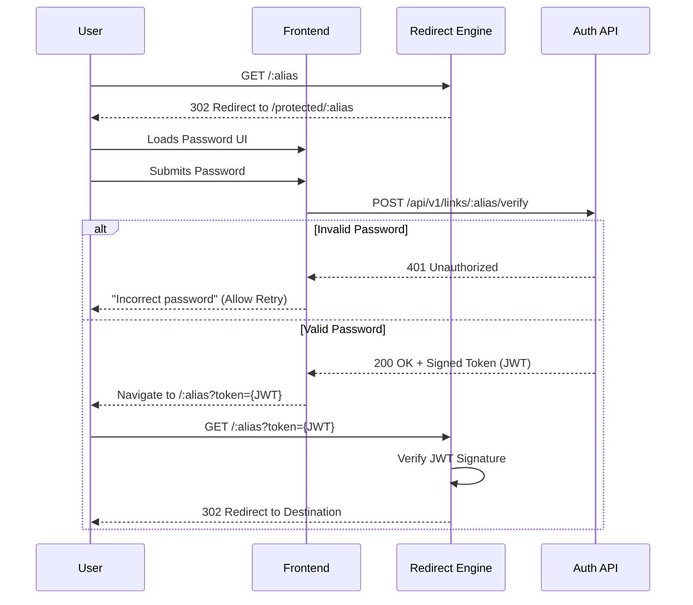

# LINKFORGE — FEATURE DESIGN DOCUMENT (FDD)
**Epic 2:** Redirect Engine  
**Story 2.2:** Password-Protected Redirects  
**Status:** Approved for Design  

---

## 1. Executive Summary
The Password-Protected Redirects feature extends the core Smart Redirect Engine to safely gate sensitive destination URLs. When a user navigates to a protected alias, they are intercepted and prompted for a password. The system utilizes stateless verification tokens to ensure horizontal scalability and zero-trust routing.

## 2. Feature Overview
- Intercepts requests for links possessing a `passwordHash`.
- Bounces users to a dedicated `/protected/:alias` frontend page.
- Provides a strict `POST` API endpoint to verify passwords against the `bcrypt` hash.
- Generates a short-lived, signed token upon successful verification.
- Re-routes the user back to the Redirect Engine using the token to unlock the destination.

## 3. Problem Statement
Users frequently share sensitive documents (e.g., financial reports, private portfolios) using short links. Without native password protection, anyone who guesses, scrapes, or intercepts the short link gains unrestricted access to the underlying content.

## 4. Business Goals
- Increase enterprise adoption by offering secure sharing mechanisms.
- Prevent brute-force password attacks on sensitive links.
- Maintain the sub-100ms latency baseline for unprotected links.

## 5. Success Metrics
- **Security:** 0 reported unauthorized bypasses of the password gate.
- **Latency:** < 150ms total verification and redirect latency.
- **Usability:** High conversion rate (successful unlocks vs. total attempts).

## 6. Product Vision
LinkForge is a Zero-Trust traffic controller. Securing links is just the first step toward advanced, conditional routing based on identity, geography, and authentication.

---

## 7. Password Redirect Lifecycle
The lifecycle separates the public intercept from the secure unlock.



## 8. User Flow
1. User clicks `linkforge.com/secret`.
2. Browser redirects to `linkforge.com/protected/secret`.
3. User sees a branded "This link is password protected" screen.
4. User enters the password and clicks "Unlock".
5. Browser transparently redirects to the final destination URL.

## 9. Sequence Diagram
*(Included in Section 7 above)*

## 10. Functional Requirements
- The Redirect Engine MUST detect if a link has a `passwordHash` and is accessed without a valid token.
- The system MUST provide an API to verify a plain-text password against a stored `bcrypt` hash.
- The API MUST return a short-lived cryptographic token upon successful validation.
- The Redirect Engine MUST accept and validate the cryptographic token via query parameter `?token=...`.
- The system MUST rate-limit password attempts.

## 11. Non-Functional Requirements
- **Statelessness:** The authentication mechanism must not rely on server-side sessions.
- **Security:** Tokens must be cryptographically signed (HMAC SHA-256) and expire within seconds.

## 12. Business Rules
- **Information Disclosure:** The password page MUST NOT display the destination URL, page title, or description.
- **Expiration:** Verification tokens are valid for a maximum of 30 seconds.
- **Single Use:** Tokens do not strictly need to be single-use since they expire rapidly, but they cannot be used to bypass analytics.

## 13. API Design

**Endpoint:** `POST /api/v1/links/:alias/verify`
**Body:**
```json
{
  "password": "user-input-password"
}
```
**Response: Success (200 OK)**
```json
{
  "success": true,
  "data": {
    "token": "eyJhbGciOiJIUzI1NiIsInR..."
  }
}
```
**Response: Failure (401 Unauthorized)**
```json
{
  "success": false,
  "error": { "message": "Incorrect password" }
}
```

## 14. Backend Architecture
- **JWT Service:** A new utility to issue and verify short-lived JSON Web Tokens using a server-side secret (`JWT_SECRET`).
- **Auth Controller:** A new controller added to the existing `links` module to handle the `/verify` endpoint.
- **Redirect Hook:** The `RedirectService` (built in Story 2.1) evaluates the `PASSWORD_REQUIRED` state and now checks `req.query.token` to bypass the lock.

## 15. Frontend Design
- **Route:** `/protected/:alias`
- **UI:** A centered, minimalist card containing a lock icon, a password input field (masked `type="password"`), and an "Unlock" button.
- **Feedback:** Inline red text for "Incorrect password" upon 401 response. Disable the button during the API request.

## 16. Password Verification Flow
1. Fetch `SmartLink` by alias.
2. Extract `passwordHash`.
3. Run `bcrypt.compare(input, hash)`.
4. If true, generate JWT containing `{ alias: "..." }` with `expiresIn: '30s'`.
5. Return JWT.

## 17. Security Design
- Passwords are never logged.
- The `bcrypt` comparison takes ~100ms, naturally defending against rapid brute force.
- Tokens are strictly bound to the specific `alias` (a token for `alias-A` cannot unlock `alias-B`).

## 18. Validation Rules
- The `/verify` endpoint requires a string password (min 1 character).
- The token parameter must be a valid JWT format.

## 19. Error Handling
- Invalid JWT signatures result in the standard `PASSWORD_REQUIRED` fallback (redirect back to the password page).
- Expired JWTs result in the same fallback.

## 20. Performance Review
- Generating a JWT takes < 1ms.
- Verifying a JWT takes < 1ms.
- `bcrypt` adds ~100ms intentionally. This is acceptable for the `/verify` route and does not affect the latency of standard (unprotected) redirects.

## 21. Scalability Strategy
By using JWTs rather than server sessions or Redis, the password verification flow is 100% horizontally scalable. Any Node.js instance can issue the token, and any other instance can verify it.

## 22. Logging Strategy
- Log successful unlocks.
- Log failed password attempts with a warning (useful for detecting brute-force attacks via monitoring tools).

## 23. Monitoring Strategy
- Track the volume of 401 Unauthorized errors on the `/verify` endpoint to trigger alerts for potential credential stuffing.

## 24. Testing Strategy
- **Unit Tests:** Ensure JWT generation uses the correct secret and expiration.
- **Integration Tests:** Attempt to access a protected link without a token. Submit a valid password. Follow the redirect using the token.
- **Security Tests:** Submit a manipulated JWT to ensure it is rejected.

## 25. Risks
- **Secret Leak:** If `JWT_SECRET` is compromised, attackers can mint tokens. **Mitigation:** Rely on robust environment variable management.
- **Token Sharing:** A user could copy the `?token=` URL and send it to a friend. **Mitigation:** The 30-second token expiration window makes manual token sharing virtually impossible.

---

## 26. Architecture Decision Records (ADR)

### ADR 1: Password Verification Strategy
**Options:**
1. Server session (cookies)
2. Redis short-lived state
3. Signed temporary token (JWT)
**Decision:** **Signed temporary token (JWT)**
**Rationale:** Cookies are complicated by cross-origin policies and require GDPR consent. Redis introduces state. A short-lived JWT passed via URL parameter (`?token=...`) is entirely stateless, highly scalable, and trivial to implement.

### ADR 2: Password Retry Policy
**Options:**
1. Fixed retry limit (lockout)
2. Rate limiting (IP/Alias based)
**Decision:** **Rate limiting**
**Rationale:** We do not want to permanently lock a link just because an attacker is guessing passwords. IP-based rate limiting (implemented at the Gateway/Nginx layer or future Epic) combined with `bcrypt`'s natural CPU delay provides the best balance of usability and security.

### ADR 3: UX Information Leakage
**Decision:** **Zero Information Disclosure**
**Rationale:** The password page will NOT display the link's title, target URL, or custom branding. Revealing this data defeats the purpose of the password gate for highly sensitive internal documents. It will only display the standard LinkForge logo and a password field.

---

## 27. Open Questions
- Do we want to allow link owners to see how many *failed* password attempts occurred? *(Deferred to Epic 3: Analytics)*.

## 28. Staff Engineer Review
**Approved.**
- The JWT approach perfectly satisfies the requirement to avoid modifying the core `GET /:alias` pipeline significantly, fulfilling the "extension point" promise made in Story 2.1.
- Security constraints regarding information disclosure are well reasoned.

---

## Implementation Readiness Checklist
- [x] Verification strategy defined (JWT)
- [x] Token expiration defined (30s)
- [x] Security implications analyzed
- [x] API contracts established
- [x] Frontend route and UX defined
