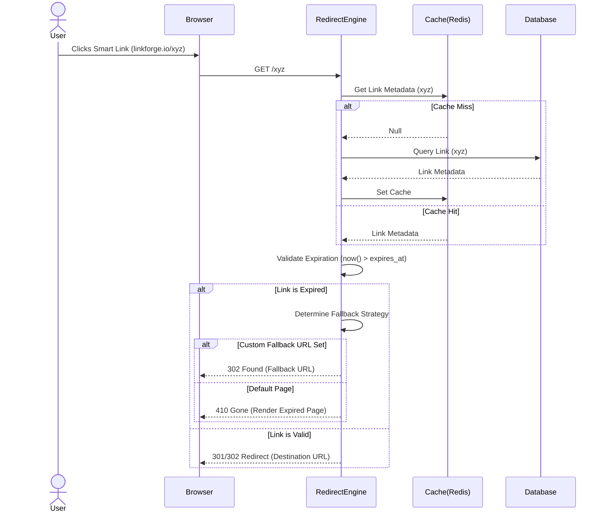
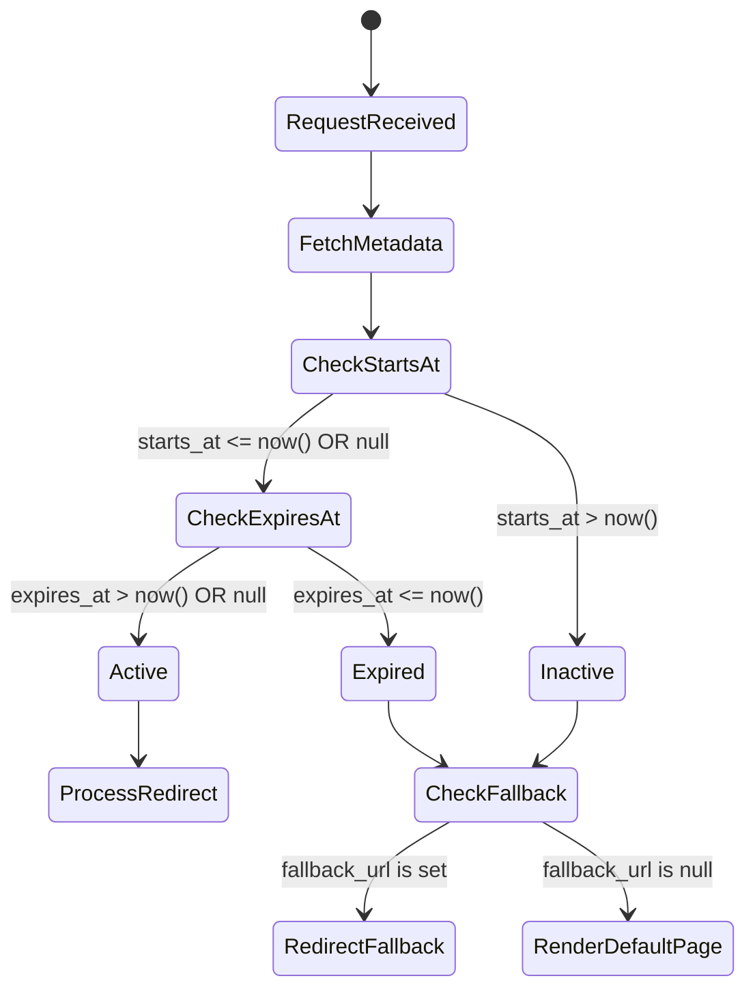

# LINKFORGE — FEATURE DESIGN DOCUMENT

## 1. Executive Summary
This document details the design for the Link Expiration Handling feature within the Redirect Engine (Story 2.3). It ensures that Smart Links can be configured to expire at a specific time or condition, and provides a robust, seamless experience when users interact with expired links. The architecture guarantees high performance by employing lazy validation during the redirect flow, coupled with background state synchronization.

## 2. Feature Overview
Link Expiration Handling allows users to set a temporal lifespan for their Smart Links. When a Smart Link's validity period elapses, the system intercepts redirection attempts and routes the user to an appropriate fallback (default expired page, custom URL, or API response) instead of the original destination.

## 3. Problem Statement
Without expiration handling, marketing campaigns and temporary promotions result in permanent links that may lead users to stale or inactive offers. This creates a poor end-user experience and potential liability for customers who cannot easily revoke access to a destination URL automatically at a precise time.

## 4. Business Goals
- Increase platform value for enterprise and marketing users by supporting time-bound campaigns.
- Enhance the user experience for end-users clicking on expired links by offering customizable fallbacks.
- Maintain the strict sub-50ms redirect latency SLA even with the addition of expiration checks.

## 5. Success Metrics
- **Performance**: Expiration checks add < 5ms to the overall redirect latency.
- **Reliability**: 100% accuracy in expiring links at the exact specified boundary.
- **Adoption**: 20% of new links created use the expiration feature within the first quarter of release.

## 6. Product Vision
LinkForge aims to be the most intelligent Smart Link management platform. Expiration handling is a foundational step towards dynamic link routing, where links intelligently adapt based on time, audience, context, and external triggers.

## 7. Expiration Lifecycle
1. **Creation**: Link created with optional `starts_at` and `expires_at` timestamps.
2. **Inactive**: Current time is strictly before `starts_at`. Link redirects to fallback.
3. **Active**: Current time is between `starts_at` and `expires_at`. Link redirects to destination normally.
4. **Expired**: Current time is strictly after `expires_at`. Link redirects to fallback.
5. **Archived**: A background process eventually flags long-expired links to clean up caches.

## 8. Request Flow
1. User clicks the Smart Link.
2. Redirect Engine intercepts the request.
3. System fetches link metadata (from Redis cache or fallback to DB).
4. System evaluates temporal validity (`now()` vs `starts_at`/`expires_at`).
5. If valid, process normal redirect (as per Story 2.1).
6. If expired or inactive, determine fallback behavior (custom URL vs default page).
7. Execute fallback redirect or render expired HTML page.
8. Asynchronously log the interaction for analytics (Story 2.4).

## 9. Sequence Diagram



## 10. Functional Requirements
- Users can set an `expires_at` datetime (UTC) when creating or updating a link.
- Users can optionally set a `starts_at` datetime (UTC) for delayed activation.
- Users can configure a `fallback_url` for expired/inactive links.
- The system must route requests for expired links to the `fallback_url` if defined, or a standard "Link Expired" page otherwise.
- Expiration checks must happen synchronously on request.

## 11. Non Functional Requirements
- **Latency**: Validation logic must execute in under 5ms.
- **Availability**: 99.99% uptime for the Redirect Engine.
- **Accuracy**: Expiration boundary resolution must be accurate to the second.

## 12. Business Rules
- If a link has no `expires_at` value, it never expires.
- If `starts_at` is in the future, the link is treated as Inactive (same redirect behavior as Expired).
- The Redirect Engine evaluates expiration lazily; database status flags are secondary to the timestamp comparison and do not block accurate evaluation.

## 13. API Design
_Note: API for Link creation/updates (Admin API - to be handled in separate API story, provided for context)_
```json
// POST /api/v1/links
{
  "destination_url": "https://example.com/offer",
  "expires_at": "2026-12-31T23:59:59Z",
  "starts_at": "2026-08-01T00:00:00Z",
  "fallback_url": "https://example.com/expired-offer"
}
```

## 14. Backend Architecture
The Redirect Engine will perform inline timestamp comparison against the retrieved link entity payload.
- The link entity from the cache will include `expires_at` and `starts_at`.
- Validation is a pure memory function: `isValid = (expires_at == null || expires_at > now) && (starts_at == null || starts_at <= now)`.

## 15. Frontend Considerations
- The admin dashboard must provide a timezone-aware date/time picker.
- All times selected in the user's local timezone must be converted to ISO 8601 UTC before sending to the backend API.
- The "Link Expired" default page should be a lightweight, unbranded (or minimally branded), and visually clean HTML page.

## 16. Expiration Validation Flow



## 17. Error Handling
- Invalid timestamp formats in Admin API requests will result in a `400 Bad Request`.
- If the default expired page template fails to render during a redirect, the engine will fallback to a raw text response or a generic `410 Gone`.

## 18. Database Considerations
- `starts_at` (TIMESTAMP WITH TIME ZONE, NULLABLE)
- `expires_at` (TIMESTAMP WITH TIME ZONE, NULLABLE)
- `fallback_url` (VARCHAR, NULLABLE)
- **Indexing**: A partial index on `expires_at` might be added later for background cleanup jobs, but for redirection, the primary lookup remains by `short_code`.

## 19. Security Review
- **SSRF Prevention**: Ensure `fallback_url` is validated against malicious schemes (e.g., allow only `http` and `https`) to prevent internal network scanning.
- **Timing Attacks**: Prevent timing anomalies by ensuring consistent evaluation times for both valid and expired links.

## 20. Performance Review
- Timestamp comparison in application memory is extremely fast (nanosecond overhead).
- Storing timestamps directly in the cached link payload ensures zero additional database queries are required during the critical redirect path.

## 21. Scalability Strategy
- The lazy validation approach scales perfectly linearly with the Redirect Engine horizontally. It requires no centralized coordination, distributed locking, or stateful expiration job processing to handle redirects correctly.

## 22. Logging Strategy
- Redirect logs (Story 2.4 - Analytics) must include the resolution status payload (e.g., `status: EXPIRED`, `status: ACTIVE`, `status: INACTIVE`).
- Logs must accurately record whether the fallback URL or default page was ultimately served.

## 23. Monitoring Strategy
- Track the metric `redirects_expired_total`.
- Implement alerts if the percentage of expired redirects spikes unusually over a short period (could indicate misconfiguration by large enterprise clients).

## 24. Testing Strategy
- **Unit Tests**: Mock `now()` to strictly verify boundary conditions (`now() == expires_at`, `now() == expires_at + 1ms`, `now() == expires_at - 1ms`).
- **Integration Tests**: Verify end-to-end routing rules when links evaluate to expired.
- **E2E Tests**: Ensure the fallback mechanism issues a `302 Found`, and the default page returns `410 Gone` based on the payload configuration.

## 25. Risks
- **Time Drift**: Clock skew across application servers could cause inconsistent expiration behavior. Mitigation: Ensure NTP sync is strictly monitored on all cluster nodes.
- **Timezone Confusion**: Clients misinterpreting UTC vs local time. Mitigation: Ensure frontend explicitly displays and handles the timezone context during link creation.

## 26. Architecture Decision Records (ADR)

### ADR 1: Expiration Strategy
- **Decision:** Scheduled activation + expiration (`starts_at` and `expires_at`).
- **Rationale:** Provides the highest flexibility for marketing campaigns (start and end times) and naturally encompasses "fixed expiration" and "never expires" (via null fields).

### ADR 2: Expired Link Behaviour
- **Decision:** Custom expired page default with optional fallback URL support.
- **Rationale:** A generic 404 is a poor UX. Providing a branded default or a custom fallback preserves the user journey and retains the audience. 

### ADR 3: Time Zone Strategy
- **Decision:** Store, process, and evaluate strictly in UTC.
- **Rationale:** Standard practice for distributed systems. Prevents insidious bugs associated with Daylight Savings Time transitions and cross-timezone administration.

### ADR 4: Background Processing vs Lazy Evaluation
- **Decision:** Lazy Evaluation for Redirects; Background Jobs for State Cleanup.
- **Rationale:** Evaluating `now() > expires_at` inline during the redirect request guarantees 100% real-time accuracy without the delay, inconsistency, or resource consumption of polling database jobs. Background jobs will be introduced in a future story purely for data hygiene and analytics state transitions.

## 27. Open Questions
- Should we allow users to customize the default expired HTML page per workspace? (Recommendation: Defer to a future Epic).
- Do we need to allow overriding the HTTP status code for fallbacks (e.g., 301 vs 302)? (Recommendation: Fix at 302 for fallbacks to avoid permanent cache poisoning if the user changes the fallback later).

## 28. Staff Engineer Review
- [x] Architecture aligns with sub-50ms latency goal.
- [x] Caching strategy is undisturbed (timestamps fit gracefully into existing payload).
- [x] Fallback logic handles edge cases cleanly.

## Implementation Readiness Checklist
- [x] FDD Reviewed and Approved.
- [ ] Database schema migrations drafted.
- [ ] Redis payload schemas updated.
- [ ] Analytics event schema updated to support expired status.
- [ ] Frontend mockups for Default Expired Page completed.
