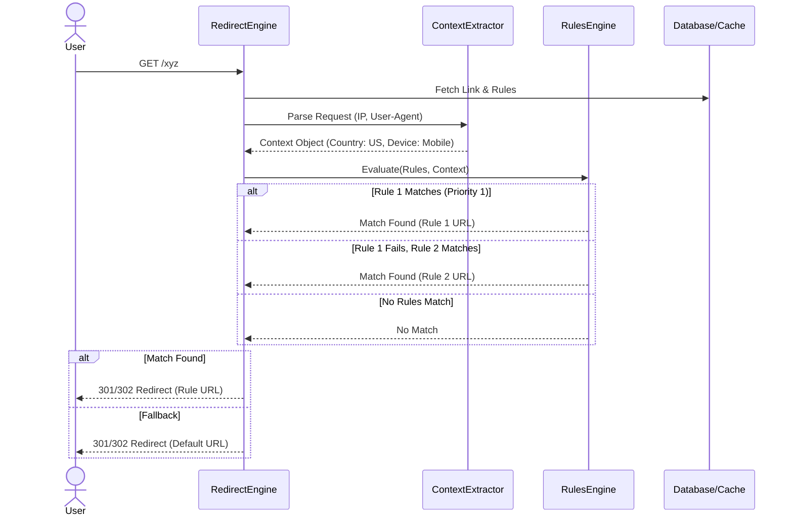
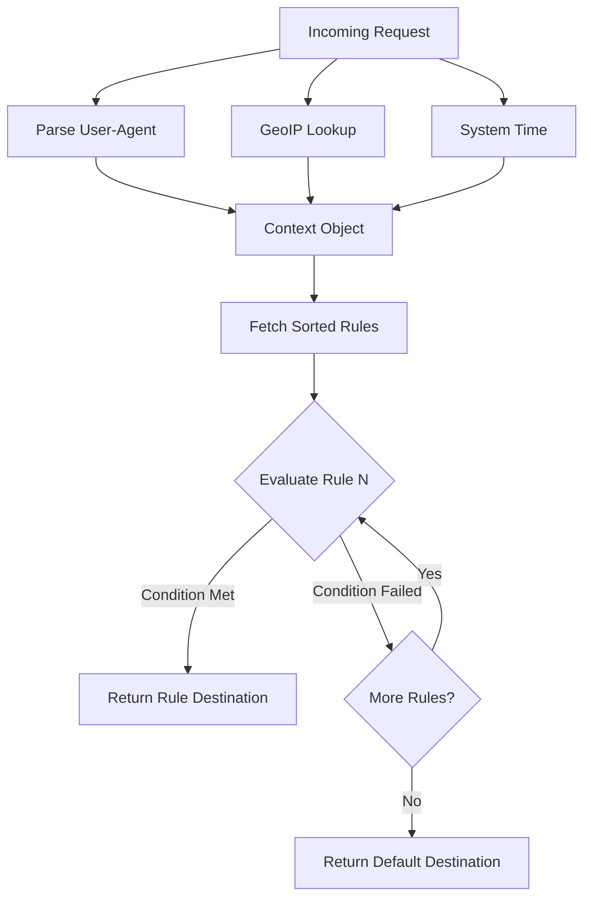

# LINKFORGE — FEATURE DESIGN DOCUMENT

## 1. Executive Summary
This document defines the architecture and design for Smart Redirect Rules (Story 2.5). The Rules Engine enables dynamic routing, allowing a single Smart Link to direct visitors to different destination URLs based on their context (Device, Country, Region, Date/Time). This design integrates seamlessly with the existing Redirect Engine, ensuring sub-50ms latency while laying an extensible foundation for complex, future-proof routing rules.

## 2. Feature Overview
Smart Redirect Rules transform static links into intelligent routing mechanisms. Link owners can define a prioritized list of conditions (e.g., "If User is on Mobile, send to App Store," or "If User is in France, send to French site"). The Redirect Engine evaluates these rules at click-time against the visitor's context and resolves the final destination dynamically.

## 3. Problem Statement
Global marketing campaigns, app downloads, and localized content currently require creating multiple distinct links for different audiences. This fragments analytics, confuses users, and increases administrative overhead. LinkForge needs a unified mechanism to route traffic intelligently from a single entry point.

## 4. Product Goals
- Consolidate fragmented campaigns into a single, intelligent Smart Link.
- Provide a highly extensible Rules Engine capable of supporting future rule types (UTM, Language, IP) with zero core architectural changes.
- Ensure rule evaluation adds no more than 5-10ms of latency to the redirect pipeline.

## 5. Success Metrics
- **Performance**: Rule evaluation executes in < 10ms (p95).
- **Adoption**: 15% of active users configure at least one Smart Rule within 60 days of release.
- **Reliability**: 100% deterministic rule resolution with zero infinite loops or unpredictable routing.

## 6. Rule Evaluation Lifecycle
1. **Creation**: User defines rules and assigns priority via the dashboard.
2. **Context Extraction**: At click-time, the Redirect Engine extracts context from the HTTP Request (Headers, IP, User-Agent, System Clock).
3. **Evaluation**: The Rules Engine processes rules sequentially based on Priority.
4. **Resolution**: The first matching rule immediately halts evaluation and returns its specific `destination_url`.
5. **Fallback**: If no rules match, the engine falls back to the link's default `destination_url`.

## 7. Request Flow



## 8. Rule Processing Pipeline


## 9. Functional Requirements
- **Context Extraction**: The system must extract Device, Country, Region, and Time context from the request.
- **Supported Operators**: Rules must support `equals`, `not_equals`, `in`, and `not_in` for strings; `greater_than`, `less_than` for dates.
- **Multiple Conditions**: A single rule can have multiple conditions (e.g., Device=Mobile AND Country=US). All conditions within a rule must be evaluated as `AND`.
- **Default Fallback**: If no rules match, the original Link destination is used.

## 10. Non Functional Requirements
- **Performance**: GeoIP lookups and User-Agent parsing must be heavily optimized or cached in memory (e.g., using fast local databases like MaxMind).
- **Extensibility**: Adding a new rule type (e.g., Browser) in the future should require only adding an extractor function and updating validation schemas, without altering the database schema.

## 11. Business Rules
- Rules are evaluated in strict priority order (1 is highest priority).
- If a rule matches, evaluation stops immediately (Short-circuiting).
- A Smart Link can have up to 20 rules (hard limit to prevent performance degradation).
- Link-level constraints (e.g., Password Protection, Expiration from Story 2.2 and 2.3) take precedence over Routing Rules. If a link is expired, rules are not evaluated.

## 12. Rule Model
A Hybrid Data Model will be used. The Rule exists as a relational row, but conditions are a JSON array.

```json
{
  "id": "rule_123",
  "linkId": "link_abc",
  "priority": 1,
  "destinationUrl": "https://example.com/mobile-us",
  "conditions": [
    { "type": "device", "operator": "eq", "value": "mobile" },
    { "type": "country", "operator": "in", "value": ["US", "CA"] }
  ]
}
```

## 13. Rule Priority
- Priority is represented by an integer column (`priority`).
- Lower numbers execute first.
- The UI must handle re-ordering and updating priorities sequentially to prevent gaps or collisions.

## 14. Conflict Resolution
- **Collision Mitigation**: If the system encounters two rules with the exact same priority integer (a theoretical edge case), it will deterministically fallback to sorting by `updatedAt` (most recently updated wins) followed by `id` (alphabetical). This guarantees predictable routing across all server instances.

## 15. API Design
_Admin API for managing rules:_
- `GET /api/v1/links/:id/rules`
- `POST /api/v1/links/:id/rules`
- `PUT /api/v1/links/:id/rules/reorder` (Bulk update priorities)
- `PUT /api/v1/links/:id/rules/:ruleId`
- `DELETE /api/v1/links/:id/rules/:ruleId`

## 16. Backend Architecture
1. **Context Extractor Service**: A highly optimized service that runs MaxMind GeoLite2 for IPs and a fast regex/library for User-Agent parsing.
2. **Rules Engine Service**: Takes the `Context Object` and the `Rule[]` array. It loops through rules, maps the `condition.type` to the `Context Object`, and applies the `operator`.
3. **Integration**: Plugs into `RedirectService.resolveAlias()` exactly after Status validation and Expiration validation, but before the final URL is returned.

## 17. Frontend Rule Builder Considerations
- The UI requires a complex but intuitive "Rule Builder" component.
- Drag-and-drop functionality for reordering rule priority.
- Dynamic dropdowns: Selecting `type = country` must populate the `value` input with a list of ISO country codes.

## 18. Database Design
**New Table: `RedirectRule`**
- `id` (UUID, PK)
- `linkId` (UUID, FK to SmartLink)
- `priority` (Integer)
- `destinationUrl` (Varchar 2048)
- `conditions` (JSONB)
- `createdAt` (Timestamp)
- `updatedAt` (Timestamp)

**Index**: `(linkId, priority)` for fast sorted retrieval.

## 19. Validation Rules
- `destinationUrl` must be a valid, safe HTTP/HTTPS URL.
- `conditions` JSON must strictly conform to a predefined JSON schema (Zod validation).
- `priority` must be > 0.
- `value` fields must match expected types for their operators (e.g., Dates must be ISO8601).

## 20. Error Handling
- If context extraction fails (e.g., malformed User-Agent or unknown IP), the specific rule condition evaluates to `false`.
- If a rule contains a corrupted or unknown condition type (legacy data), the rule evaluates to `false`.
- The engine will safely degrade to the default link destination rather than throwing a 500 Server Error.

## 21. Security Review
- **SSRF Prevention**: The `destinationUrl` inside rules must undergo the same strict Zod SSRF validation as the main link URL.
- **ReDoS**: User-Agent parsing libraries must be vetted against Regular Expression Denial of Service attacks.
- **IP Spoofing**: Extracting the client IP must securely respect trusted proxies (`X-Forwarded-For` chains configured in Express/Nginx).

## 22. Performance Review
- **GeoIP**: Must be done locally in-memory. Hitting external APIs (like IPStack) during the redirect pipeline is unacceptable.
- **Payload Size**: Storing conditions as JSONB allows the entire Rule set for a link to be cached as a single stringified payload in Redis, requiring 0 extra DB queries during redirect.

## 23. Scalability Strategy
- The hybrid JSONB approach allows us to add `browser`, `os`, and `utm` rule types later purely in application logic, without running blocking `ALTER TABLE` migrations on a multi-million row table.

## 24. Logging Strategy
- The redirect analytics event (Story 2.4/Epic 3) must include a new field: `matchedRuleId`. If no rule matched, this is `null`.
- This allows link creators to see exactly how much traffic each specific rule is capturing.

## 25. Monitoring Strategy
- Track average latency of the Context Extraction phase (`metric: context_extraction_ms`).
- Track average latency of the Rules Engine evaluation (`metric: rules_evaluation_ms`).
- Alert if GeoIP database becomes stale or fails to load into memory on app boot.

## 26. Testing Strategy
- **Unit Tests**: Pass dummy Context Objects into the Rules Engine and verify operator logic (`eq`, `in`, `gt`).
- **Integration Tests**: Verify the `ContextExtractor` correctly parses specific IP addresses and User-Agent strings.
- **E2E Tests**: Hit a Smart Link with specific headers (`User-Agent: iPhone`) and assert the 302 Location matches the Mobile rule.

## 27. Risks
- **Complexity**: Rule engines can quickly become "spaghetti" code if not strictly modeled. Mitigation: Strict Zod schemas for the JSON condition payload.
- **Latency**: Parsing IP to Country takes time. Mitigation: Use mmdb (MaxMind DB) for microsecond lookups.

## 28. Architecture Decision Records (ADR)

### ADR 1: Rule Evaluation Strategy
- **Decision:** Priority-based Evaluation.
- **Rationale:** Gives users explicit control and deterministic outcomes. "First match wins" based on arbitrary database order is fragile. Weighted systems are too complex for typical marketing users.

### ADR 2: Rule Storage Architecture
- **Decision:** Relational Table with JSONB conditions (`Hybrid Approach`).
- **Rationale:** A pure relational model (e.g., `Rule` -> `RuleCondition` -> `RuleConditionValue`) requires massive table joins and complex schemas for different data types (strings vs dates). JSONB allows rigid schema validation in the application layer while remaining highly extensible for future types.

### ADR 3: Default Destination Fallback
- **Decision:** Fallback to the original `SmartLink.destinationUrl`.
- **Rationale:** Prevents dead ends. If a marketer targets Mobile users but forgets Desktop users, Desktop users will still reach the primary campaign URL.

### ADR 4: Conflict Resolution
- **Decision:** Lowest integer priority wins. In collisions, newest `updatedAt` wins.
- **Rationale:** Guarantees that evaluation across instances in a distributed cluster will always yield the exact same routing decision, preventing flapping.

## 29. Open Questions
- Do we need an "AND/OR" toggle between conditions within a single rule? (Recommendation for V1: All conditions within a rule are implicitly `AND`. To achieve `OR`, users create a second rule with the same destination. This keeps the builder UX and engine logic simple).
- Should we provide MaxMind GeoLite2 in the Docker image, or require an API key? (Recommendation: Ship the free GeoLite2 mmdb file and auto-update it via background cron).

## 30. Staff Engineer Review
- [x] Evaluation strategy is strictly deterministic.
- [x] Database architecture gracefully handles future extensibility.
- [x] Performance safeguards (in-memory GeoIP) are identified.

## Implementation Readiness Checklist
- [x] FDD Reviewed and Approved.
- [ ] MaxMind GeoIP library integrated.
- [ ] User-Agent parser library integrated.
- [ ] `RedirectRule` Prisma schema drafted.
- [ ] JSONB schema (Zod) drafted.
- [ ] Frontend Rule Builder wireframes completed.
