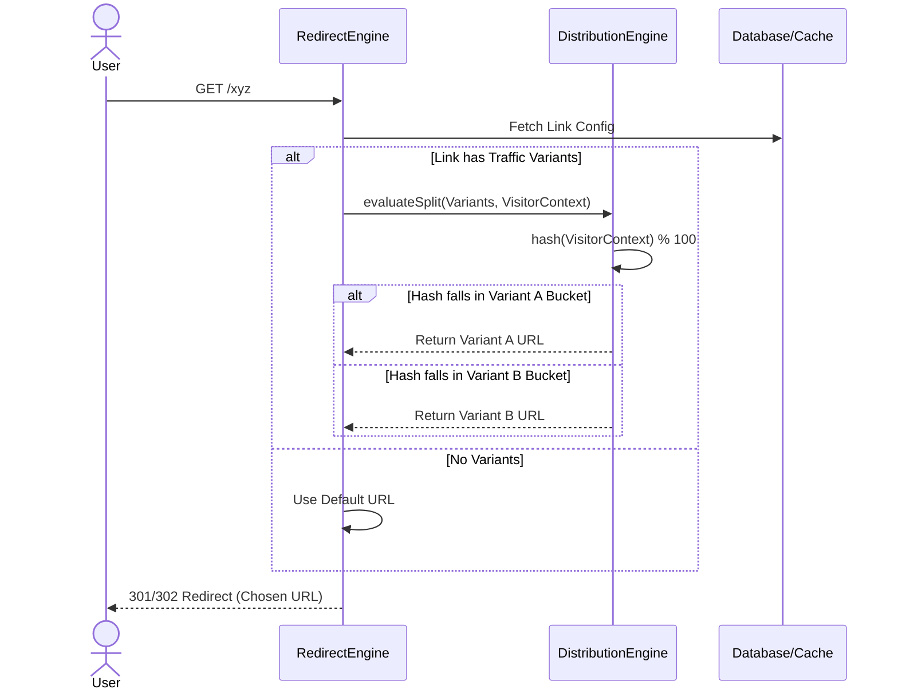
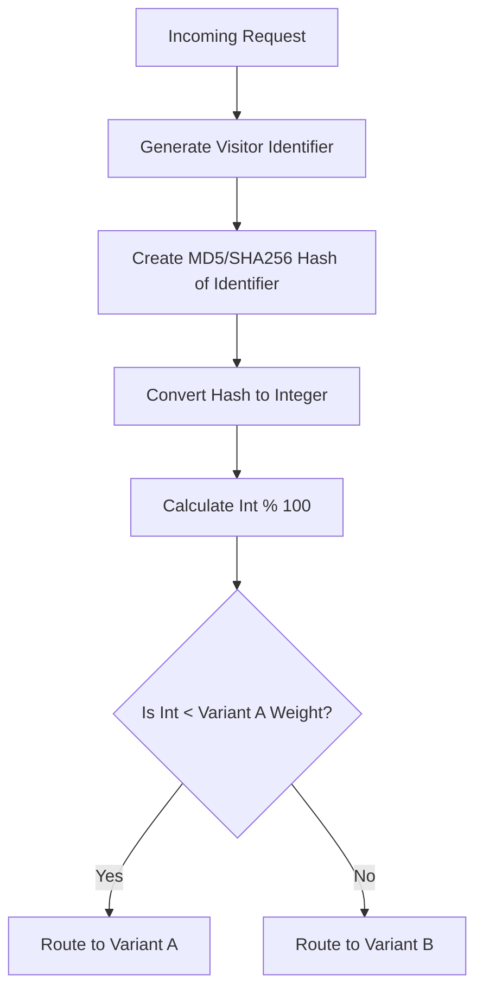

# LINKFORGE — FEATURE DESIGN DOCUMENT

## 1. Executive Summary
This document outlines the architecture for the Traffic Distribution Engine (Story 2.6). This feature introduces the ability to split traffic across multiple destination URLs based on configurable percentage weights. Designed initially for A/B testing, the architecture establishes a deterministic routing foundation that seamlessly integrates into the Redirect Engine while setting the stage for future canary releases and blue-green deployments.

## 2. Feature Overview
The Traffic Distribution Engine allows LinkForge users to define two destination variants (Variant A and Variant B) for a single Smart Link and allocate traffic between them (e.g., 50/50, 80/20). When users click the link, the engine calculates a deterministic hash based on their unique visitor context and routes them to the appropriate variant.

## 3. Problem Statement
Marketers and developers frequently need to test different landing pages or rollout new features gradually to measure impact. Creating separate links for each variant fragments traffic and makes comparative analytics impossible. LinkForge must natively support traffic splitting at the edge to enable data-driven optimization.

## 4. Business Goals
- Enable marketers to perform rigorous A/B testing on landing pages.
- Provide engineering teams a safe mechanism for gradual feature rollouts via links.
- Maintain sub-50ms redirect latency even when calculating traffic splits.

## 5. Success Metrics
- **Performance**: Distribution calculation adds < 2ms to the redirect flow.
- **Accuracy**: Traffic distribution closely matches the configured percentages (±1% variance over 10,000 clicks).
- **Adoption**: 10% of top-tier accounts utilize traffic splitting within 30 days of release.

## 6. Traffic Distribution Lifecycle
1. **Configuration**: User configures Variant A (e.g., 80%) and Variant B (e.g., 20%).
2. **Context Capture**: User clicks the link; engine captures visitor IP and User-Agent.
3. **Hashing**: Engine generates a deterministic integer (0-99) using a hash of the visitor's context.
4. **Resolution**: The integer falls into a distribution bucket, resolving to the winning variant.
5. **Redirection**: User is redirected to the variant URL.

## 7. Request Flow



## 8. Variant Selection Algorithm


## 9. Functional Requirements
- **Weights**: Users must be able to specify percentage weights that equal 100%.
- **Variants**: V1 must support exactly two variants (including the default destination as one variant, or two entirely new ones).
- **Consistency**: A single visitor clicking the link multiple times must always be routed to the same variant.
- **Default**: A default fallback destination must exist if distribution fails.

## 10. Non Functional Requirements
- **Statelessness**: The engine must not rely on querying a database for sticky session states.
- **Performance**: Cryptographic hashing for deterministic resolution must use highly optimized algorithms (e.g., MurmurHash3 or FNV-1a).

## 11. Business Rules
- Traffic splitting occurs *after* Expiration Rules (Story 2.3) and Password Rules (Story 2.2), but *before* or *integrated with* Smart Routing Rules (Story 2.5). 
- If a Smart Rule (Geo/Device) explicitly matches, it overrides generic traffic distribution.
- Variant percentages must strictly equal exactly 100.

## 12. Domain Model
Traffic configuration will be stored as a JSON array within the `SmartLink` model to ensure atomic configuration updates.

```json
// Example traffic configuration payload
[
  { "url": "https://example.com/v1", "weight": 80 },
  { "url": "https://example.com/v2", "weight": 20 }
]
```

## 13. Traffic Allocation Strategy
- **Strategy**: Deterministic Consistent Hashing.
- **Visitor Identifier**: A combination of IP Address and User-Agent (`hash(ip + userAgent)`).
- **Why**: This guarantees sticky assignment (Visitor Consistency) without dropping cookies or requiring Redis session storage. This satisfies the requirement that a single visitor doesn't flip-flop between A/B testing variants, which would ruin conversion tracking.

## 14. API Design
_Admin API modifications for Link updates:_
```json
// PUT /api/v1/links/:id/traffic
{
  "variants": [
    { "url": "https://example.com/old", "weight": 80 },
    { "url": "https://example.com/new", "weight": 20 }
  ]
}
```

## 15. Backend Architecture
- **`TrafficDistributionService`**: A pure, stateless service. Exposes a method `resolveVariant(variants: Variant[], visitorId: string): string`.
- **Integration**: Placed directly inside `RedirectService.resolveAlias()`.

## 16. Frontend Configuration UI
- A slider or dual-input component allowing users to split traffic 0-100.
- Automatic mathematical enforcement (if Input A becomes 70, Input B automatically becomes 30).
- Visual warning explaining that changing weights mid-experiment may shuffle existing sticky assignments.

## 17. Database Design
Modify `SmartLink` table:
- Add `trafficVariants` (JSONB, Nullable).
- For V1, the JSON holds the array of `{ url, weight }` objects.

## 18. Validation Rules
- `trafficVariants` must be an array of exactly 2 items (for V1).
- `weight` must be an integer between 1 and 99.
- The sum of all `weight` properties must equal exactly 100.
- `url` must pass standard URL validation schemas.

## 19. Error Handling
- If hashing fails or variant URLs are corrupted, the engine gracefully catches the exception and returns the default `SmartLink.destinationUrl`.

## 20. Security Review
- **Fingerprint Privacy**: The `Visitor Identifier` is purely transient in memory. It is hashed, evaluated, and immediately garbage collected. We do not store raw IP fingerprints in connection to variant tracking.
- **SSRF**: Variant URLs must undergo standard SSRF protection checks (no internal IP spaces).

## 21. Performance Review
- **Hashing Speed**: Using FNV-1a (non-cryptographic fast hash) or MD5 takes negligible CPU cycles (< 0.1ms).
- **DB Operations**: Zero extra joins or queries required since variants are bundled in the cached Link payload.

## 22. Scalability Strategy
- Because the algorithm is purely math-based and stateless, traffic distribution scales perfectly horizontally alongside the Node.js processes. There is no central lock or shared counter required to maintain the 80/20 split.

## 23. Logging Strategy
- The Redirect Analytics event (Epic 3) must capture a `variantUrl` field.
- This allows link owners to filter click analytics and compare conversion rates between Variant A and Variant B in the dashboard.

## 24. Monitoring Strategy
- Track the metric `redirects_variant_total` grouped by URL to verify the hash distribution aligns with the configured percentages in production.

## 25. Testing Strategy
- **Unit Tests**: Pass 10,000 randomized `visitorId` strings into `TrafficDistributionService` and assert that the resulting variant distribution falls within ±2% of the configured weights.
- **Integration Tests**: Verify that the same `visitorId` string yields the same variant URL 100% of the time (Determinism).

## 26. Risks
- **Hash Collisions / Clumping**: A poor hash algorithm might clump traffic poorly, skewing an 80/20 split to 90/10. Mitigation: Use a proven hashing algorithm and write rigorous distribution unit tests.
- **Shared IP Pools**: Corporate offices or VPNs share IPs, meaning all users in that office get the same variant. Mitigation: Acceptable tradeoff for V1 statelessness. V2 can explore cookie-based stickiness.

## 27. Architecture Decision Records (ADR)

### ADR 1: Traffic Allocation Strategy
- **Decision:** Consistent Hashing via IP + User-Agent fingerprint.
- **Rationale:** Random selection breaks A/B tests (user refreshes and sees a different page). Storing sticky sessions requires massive database scale. Deterministic hashing solves both problems perfectly at the edge.

### ADR 2: Variant Storage
- **Decision:** JSONB array directly on the Smart Link model.
- **Rationale:** Avoids `JOIN` overhead. Traffic splitting requires atomic reads during the redirect flow.

### ADR 3: Failure Handling
- **Decision:** Use fallback destination (Default `destinationUrl`).
- **Rationale:** Safest behavior. Dropping traffic or looping is unacceptable. If the engine errors out, routing to the original default link guarantees traffic survives.

## 28. Open Questions
- Do we want to support Cookie-based stickiness in addition to IP hashing? (Recommendation: Defer to a future epic. Dropping cookies requires GDPR compliance banners on redirect, which breaks seamless routing).

## 29. Staff Engineer Review
- [x] Architecture ensures strict A/B testing integrity (stickiness).
- [x] Latency constraints (sub-50ms) are easily maintained by the stateless approach.
- [x] The design is inherently forward-compatible with multi-variant (A/B/C/D) routing.

## Implementation Readiness Checklist
- [x] FDD Reviewed and Approved.
- [ ] Implement fast-hashing library (e.g., `fnv1a` or standard crypto).
- [ ] Update `SmartLink` Prisma schema.
- [ ] Update validation schemas for 100% sum constraints.
- [ ] Create UI sliders for weight allocation.
