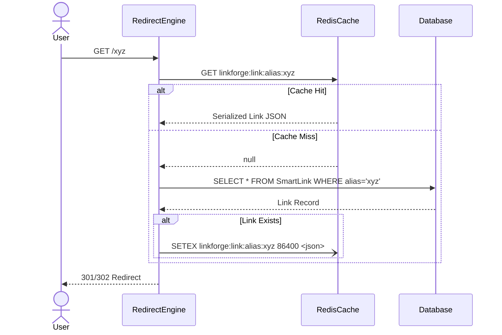
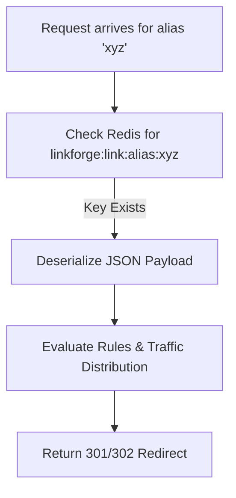
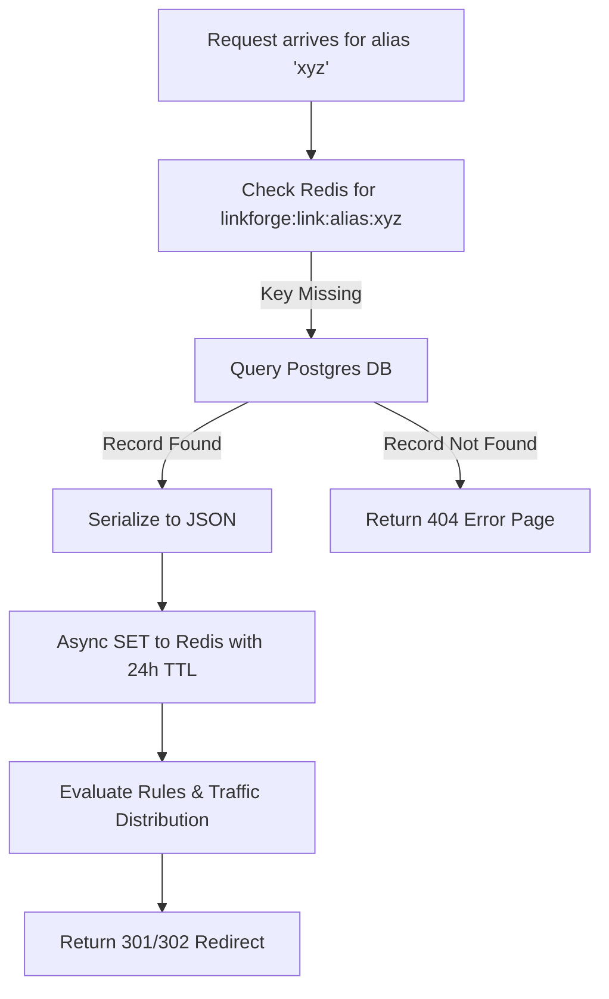

# LINKFORGE — FEATURE DESIGN DOCUMENT

## 1. Executive Summary
This document outlines the architecture for integrating Redis Caching into the Redirect Engine (Story 2.7). To support millions of concurrent redirects with sub-10ms latency, LinkForge must decouple link resolution from relational database queries. By introducing a highly optimized Redis caching layer, we drastically reduce Postgres load, prepare the platform for horizontal scaling, and ensure lightning-fast redirect speeds globally.

## 2. Feature Overview
The caching layer sits directly in front of the database. When a visitor requests a Smart Link, the Redirect Engine will attempt to fetch the link configuration (including rules and variants) from Redis memory. Only on a cache miss will the engine query the database and subsequently populate the cache.

## 3. Problem Statement
Currently, every link click executes a `SELECT` query against the Postgres database. As traffic grows, this read-heavy workload will overwhelm the database connections, causing latency spikes, high infrastructure costs, and potential downtime during traffic surges (e.g., viral campaigns). 

## 4. Business Goals
- Eliminate database dependency for the hot-path redirect flow.
- Ensure link resolution takes < 5ms at the application edge.
- Support viral link traffic surges without requiring immediate Postgres scaling.

## 5. Success Metrics
- **Cache Hit Ratio**: Maintain > 95% cache hit ratio across all redirect requests.
- **Latency**: 99th percentile (p99) redirect resolution time under 10ms.
- **Database Load**: Reduce Postgres read IOPS on the `SmartLink` table by 90%.

## 6. Cache Lifecycle
1. **Creation**: When a link is accessed for the first time, it is fetched from Postgres and stored in Redis as a serialized JSON string.
2. **Access**: Subsequent clicks fetch the JSON string directly from Redis in memory.
3. **Invalidation**: Whenever a Link owner edits the link (changes URL, updates rules, modifies traffic distribution), the API aggressively deletes the Redis key.
4. **Eviction**: Keys expire automatically after 24 hours of inactivity to free up Redis memory (TTL).

## 7. Request Flow

## 8. Cache Hit Flow

## 9. Cache Miss Flow

## 10. Functional Requirements
- **Cache-Aside Pattern**: The application code is responsible for checking the cache, querying the DB on miss, and writing to the cache.
- **Graceful Degradation**: If the Redis cluster goes down or times out, the engine must safely fall back to querying Postgres directly without dropping traffic.
- **Atomic Invalidation**: Link updates must purge the cache key.

## 11. Non Functional Requirements
- **Serialization**: Cached data must encompass all relations required for redirection (Rules, Traffic Variants, Expiration Data).
- **Timeouts**: Redis queries must have a strict 50ms timeout. If Redis is sluggish, it's better to hit Postgres than to hang the user.

## 12. Business Rules
- Caching only applies to the Public Redirect Engine. Admin Dashboard queries (e.g., "View all my links") will continue reading directly from the database to ensure pagination and search accuracy.
- Password verification states (Story 2.2) are NOT cached in Redis (passwords remain validated dynamically against the hash).

## 13. Cache Architecture
- **Strategy**: Cache-Aside with Event-Driven Invalidation.
- **Why**: LinkForge has an extreme Read-to-Write ratio. Links are clicked thousands of times but edited rarely. Cache-aside ensures we only cache active links (preventing memory bloat), while event-driven invalidation guarantees the cache is never stale.

## 14. Cache Key Design
- **Format**: `[namespace]:[entity]:[identifier_type]:[identifier]`
- **Implementation**: `linkforge:link:alias:{shortCode}`
- **Reasoning**: Namespacing prevents collisions if Redis is shared with other services or background workers (like BullMQ).

## 15. Cache Invalidation Strategy
The key `linkforge:link:alias:{shortCode}` must be deleted (`DEL`) when:
- A link's destination URL is edited.
- A link's status changes (Archived, Restored, Disabled).
- Smart Rules are added, updated, or removed.
- Traffic Distribution variants are modified.
- Link expiration or password constraints are altered.

## 16. TTL Strategy
- **Strategy**: Fixed 24-hour TTL (Time-To-Live).
- **Implementation**: `SETEX linkforge:link:alias:xyz 86400 <payload>`
- **Reasoning**: Event-driven invalidation handles 99% of consistency. The 24-hour TTL acts as a garbage collection safety net, ensuring links that go viral for a day and then die don't consume Redis memory indefinitely.

## 17. API Impact
- **Redirect Engine API**: Unchanged externally. Internal latency will drop significantly.
- **Admin Link API**: All `PUT`, `PATCH`, and `DELETE` endpoints in `link.controller.ts` and `rule.controller.ts` must be updated to purge the Redis cache upon successful DB mutation.

## 18. Backend Design
- **`RedisCacheService`**: A wrapper around `ioredis` that abstracts `get`, `set`, and `delete` operations, including circuit breaking and timeout logic.
- **Integration in `LinkRepository`**: The `findByAlias` method will check the `RedisCacheService` before hitting Prisma. 
- **Integration in `EditLinkService` / `RuleController`**: After a successful Prisma mutation, these services will call `RedisCacheService.delete(alias)`.

## 19. Infrastructure Design
- **Component**: Redis Server (v7+).
- **Deployment**: Managed Redis (e.g., AWS ElastiCache, Upstash, or Docker container for local dev).
- **Eviction Policy**: `allkeys-lru`. If Redis runs out of memory before TTLs expire, it will evict the least recently used keys (cold links) to make room for hot links.

## 20. Database Considerations
- Reduces read pressure on Postgres by an estimated 95-99%.
- Frees up connection pool limits, allowing the backend to scale horizontally effortlessly.

## 21. Error Handling
- **Redis Unreachable**: If `ioredis` fails to connect or throws an error, the `RedisCacheService` must swallow the error, log a warning, and return `null`, allowing the app to fallback to Postgres safely.

## 22. Security Review
- **Data Privacy**: No sensitive PII is stored in the cache. Only the public redirect configuration. Password hashes are cached, but they are hashed via Argon2/Bcrypt and cannot be reversed if Redis is compromised.
- **Cache Poisoning**: Strict validation (Zod) occurs before data enters the database, ensuring the cache is only ever populated with safe, sanitized data.

## 23. Performance Review
- **Serialization Cost**: `JSON.stringify` and `JSON.parse` are incredibly fast on modern V8 engines, adding negligible overhead (< 0.1ms).
- **Network Cost**: Redis queries via connection pooling typically resolve in < 1ms on the same local network/VPC.

## 24. Scalability Strategy
- The Cache-Aside architecture allows us to add infinite read replicas to the backend servers. Since they all point to the same centralized Redis cluster, state remains consistent globally.

## 25. Logging Strategy
- Log Cache Hit Ratios periodically.
- Emit a `WARN` log if Redis fails or falls back to the database gracefully.

## 26. Monitoring Strategy
- **Metric**: `cache_hit_rate`
- **Metric**: `redis_latency_ms`
- **Metric**: `redis_memory_usage`
- Alert engineers if `cache_hit_rate` drops below 70%, indicating a potential invalidation bug or memory eviction issue.

## 27. Testing Strategy
- **Unit Tests**: Mock `ioredis` and assert that `CacheService.get` returns parsed JSON, and `CacheService.set` stringifies correctly.
- **Integration Tests**: 
  - Call `/xyz` (Miss -> DB hit).
  - Call `/xyz` again (Hit -> Redis hit).
  - Call `PATCH /api/v1/links/xyz` (Invalidate).
  - Call `/xyz` (Miss -> DB hit).

## 28. Risks
- **Cache Stampede (Thundering Herd)**: If a highly viral link expires from cache, thousands of concurrent requests might hit the DB simultaneously before the cache is repopulated. Mitigation: Not an immediate risk for V1, but can be mitigated later with Mutex locks or Promise deduplication on the Node layer.
- **Stale Data**: If a DB transaction succeeds but the Redis `DEL` command fails (network blip), the cache becomes stale. Mitigation: The 24h TTL eventually fixes this, but retries on the `DEL` command should be implemented.

## 29. Architecture Decision Records (ADR)

### ADR 1: Cache Strategy
- **Decision:** Cache-Aside with Event-Driven Invalidation.
- **Rationale:** The industry standard for read-heavy API workloads. Easy to reason about, simple to implement, and degrades gracefully on failure.

### ADR 2: Eviction Policy
- **Decision:** `allkeys-lru` with a 24-hour TTL.
- **Rationale:** Ensures we only keep active links in expensive RAM. If we hit memory ceilings, LRU safely drops dead links without impacting viral traffic.

### ADR 3: Invalidation Mechanism
- **Decision:** Purge (`DEL`) the key on write, rather than updating it (`SET`).
- **Rationale:** Purging is much safer. If we attempt to update the cache directly, we risk race conditions where the cache falls out of sync with the database relations (Rules, Variants). Purging forces a clean, atomic read on the next request.

## 30. Open Questions
- Do we want to implement Promise deduplication (Thundering Herd protection) now? (Recommendation: No. Keep it KISS for V1. Postgres can handle temporary spikes of a few hundred queries).

## 31. Staff Engineer Review
- [x] Graceful degradation is explicitly defined.
- [x] Cache key naming conventions prevent collisions.
- [x] Invalidation lifecycle covers all mutation endpoints.

## Implementation Readiness Checklist
- [x] FDD Reviewed and Approved.
- [ ] Install `ioredis`.
- [ ] Implement `RedisCacheService`.
- [ ] Update `LinkRepository.findByAlias`.
- [ ] Update all mutation controllers to purge cache.
