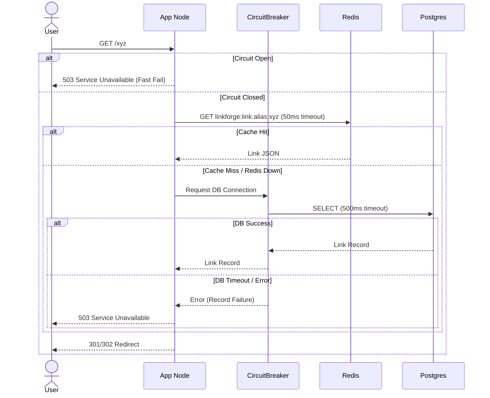
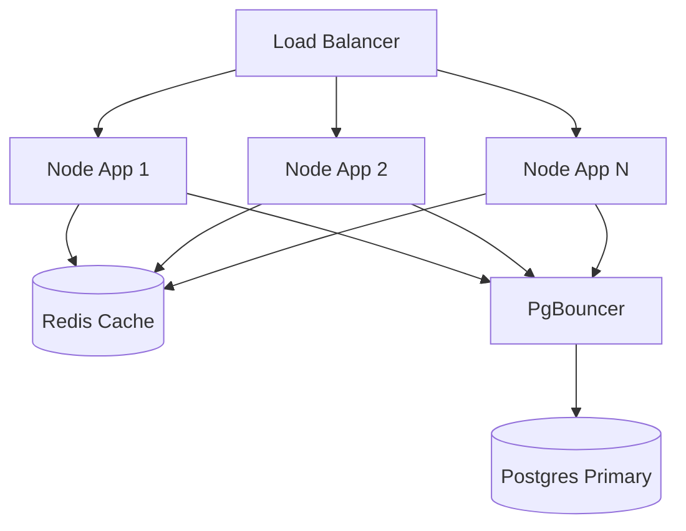

# LINKFORGE — FEATURE DESIGN DOCUMENT

## 1. Executive Summary
This document defines the production hardening layer for the Redirect Engine (Story 2.8). While earlier stories successfully implemented rules, traffic distribution, and caching, this phase focuses entirely on Performance and Reliability. The goal is to ensure the Redirect Engine remains exceptionally fast, highly available (99.99%), and robust under extreme load, network partitioning, and backend degradation.

## 2. Feature Overview
This feature introduces strict connection management, circuit breakers, timeout enforcement, and comprehensive observability (metrics/logging) to the Redirect Engine. It ensures that traffic spikes or infrastructure hiccups do not cause cascading failures, and that engineers have the telemetry required to monitor SLOs in real-time.

## 3. Problem Statement
Without strict connection limits and timeouts, a slowdown in PostgreSQL or Redis can quickly exhaust the Node.js event loop or connection pools. This leads to unbounded latency, 502 Bad Gateway errors, and cascading platform outages. Additionally, without proper metrics, we cannot proactively detect or debug performance degradation.

## 4. Business Goals
- Guarantee an uninterrupted redirect experience for end-users, even during backend infrastructure degradation.
- Ensure the Redirect Engine can scale horizontally without exhausting database connections.
- Provide transparent observability into platform health for the SRE team.

## 5. Success Metrics
- **Availability**: Maintain 99.99% uptime for the Redirect API.
- **Latency Consistency**: Zero spikes above 100ms during normal operation.
- **Error Rate**: < 0.01% HTTP 5xx errors during high traffic.

## 6. Performance Objectives
Realistic production Service Level Objectives (SLOs):
- **Average Latency**: < 10ms
- **P95 Latency**: < 20ms
- **P99 Latency**: < 50ms
- **Throughput**: 10,000+ Requests Per Second (RPS) per Node.js instance.

## 7. Reliability Objectives
- **Resilience**: The system must gracefully degrade. If Redis fails, traffic routes to Postgres. If Postgres fails, the system returns a rapid 503 instead of hanging.
- **Circuit Breaking**: Repeated failures to the DB must trip a circuit breaker to protect the DB from further overload.

## 8. Redirect Lifecycle (Hardened)

## 9. Failure Scenarios
- **PostgreSQL is slow**: Queries exceed 500ms. The request is aborted, a 503 is returned, and the error contributes to the Circuit Breaker error threshold.
- **Redis is unavailable**: The 50ms connection timeout triggers. The app logs a warning, increments the `redis_failure` counter, and falls back to Postgres.
- **Database connection pool exhausted**: The ORM throws a `Timeout` acquiring a connection. The Circuit Breaker immediately trips if this happens sequentially, returning 503s until the pool recovers.

## 10. Functional Requirements
- Implement strict timeouts on all external network calls (DB, Cache).
- Implement a Circuit Breaker pattern around database reads.
- Expose a `/metrics` endpoint for Prometheus scraping.

## 11. Non Functional Requirements
- Observability instrumentation must not add more than 1ms of overhead to the redirect flow.
- Health checks must accurately reflect upstream dependencies.

## 12. Performance Strategy
- **Minimize Payload**: Prisma `select` statements will be optimized to only fetch exactly what is required for redirection, minimizing JSON serialization overhead and network bandwidth.
- **Keep-Alive**: Ensure HTTP Keep-Alive is enabled on the Express server to prevent TLS handshake overhead for repeat visitors.

## 13. Reliability Strategy
- **Circuit Breaker**: Implement `opossum` (or similar) around Prisma calls. If 50% of requests fail within 10 seconds, open the circuit for 5 seconds to let the DB recover.
- **Graceful Shutdown**: Implement SIGTERM handlers to finish inflight redirects before the Node process exits during deployments.

## 14. Infrastructure Design

## 15. Backend Design
- **Metrics Middleware**: Express middleware that intercepts requests and measures response time using `process.hrtime()`.
- **Health Controller**: Expose `/health` (Liveness) and `/ready` (Readiness). Readiness checks Redis and DB pings.

## 16. Database Optimization
- Ensure PgBouncer is configured in `Transaction` mode to handle thousands of short-lived redirect queries across multiple Node processes.
- Ensure Prisma's connection pool size is explicitly calculated (`connection_limit = (total_pgbouncer_pool / num_node_instances)`).

## 17. Redis Optimization
- Use `ioredis` with `enableOfflineQueue: false` to ensure requests fail fast rather than queuing in memory if Redis disconnects.
- `commandTimeout: 50` already implemented in Story 2.7.

## 18. Connection Management
- **PostgreSQL Pool**: Prisma configured with `connection_limit=10` and `pool_timeout=5`.
- **Redis Pool**: `ioredis` inherently multiplexes over a single TCP connection.
- **Retry Strategy**: 1 retry for Redis connection initialization. 0 retries for synchronous DB reads (fail fast is better than queuing).

## 19. Logging Strategy
- Use structured JSON logging (`pino` or `winston`).
- Every redirect log must include: `alias`, `latency_ms`, `cache_hit`, `status_code`.
- Do NOT log IP addresses directly in standard output to maintain GDPR compliance (hash them if necessary).

## 20. Monitoring Strategy
Instrument `prom-client` to expose metrics on `/metrics`:
- `http_requests_total{method="GET", route="/:alias", status="302"}`
- `http_request_duration_seconds` (Histogram)
- `cache_hits_total{cache="redis"}`
- `db_query_duration_seconds` (Histogram)

## 21. Alerting Strategy
SREs receive PagerDuty alerts if:
- `P99 Latency > 100ms` for 5 consecutive minutes.
- `Error Rate (5xx) > 1%` over a 1-minute rolling window.
- `Cache Hit Ratio < 70%` (Warning Level).

## 22. Scalability Strategy
With PgBouncer and Redis Cache-Aside, the Redirect Engine is completely stateless. Kubernetes HPA (Horizontal Pod Autoscaler) can seamlessly scale the deployment from 2 to 100 pods based on CPU utilization during traffic surges.

## 23. Security Review
- **DDoS Mitigation**: Ensure Express rate limiters are configured to prevent malicious actors from spamming cache misses (Random String attacks) that bypass Redis and hammer Postgres.
- **Metrics Exposure**: Ensure the `/metrics` endpoint is protected or only exposed on an internal Kubernetes port, not the public internet.

## 24. Testing Strategy
- **Chaos Testing**: Manually kill Redis during tests and assert the application falls back without 500 errors.
- **Timeout Testing**: Mock Postgres to take 1000ms and assert the Circuit Breaker trips and returns 503s.

## 25. Load Testing Strategy
- Use `k6` or `Artillery`.
- **Test 1 (Cache Hot)**: 10,000 RPS on a single cached link. Expect < 10ms latency.
- **Test 2 (Cache Cold)**: 1,000 RPS on unique random links. Expect Postgres to handle it gracefully within connection limits.

## 26. Risks
- **Prisma Connection Exhaustion**: Prisma establishes a new connection pool per process. If we scale to 50 pods, that's 50 pools. Mitigation: Neon's PgBouncer integration handles this natively.
- **Memory Leaks**: Observability metrics (Histograms) can leak memory if cardinality is too high (e.g., tagging metrics with dynamic `alias` strings). Mitigation: Tag metrics with generic routes `/:alias`, not the actual alias value.

## 27. Architecture Decision Records (ADR)

### ADR 1: Circuit Breaker Pattern
- **Decision:** Implement Circuit Breaker on DB reads during Redirect flow.
- **Rationale:** A slow database causes requests to hang, eating up Node memory until OOM. Failing fast (503) preserves the server to handle cached requests successfully.

### ADR 2: Observability Stack
- **Decision:** Prometheus metrics endpoint natively exposed via Node.
- **Rationale:** Industry standard. Integrates seamlessly with Grafana and Datadog.

## 28. Open Questions
- Should rate limiting be handled at the Application layer or the Ingress/Cloudflare layer? (Recommendation: Cloudflare for DDoS, Application layer for granular tenant limits).

## 29. Staff Engineer Review
- [x] Timeouts are strictly defined for all network boundaries.
- [x] Graceful degradation paths are complete and robust.
- [x] Metrics cardinality risks are addressed.

## Implementation Readiness Checklist
- [x] FDD Reviewed and Approved.
- [ ] Install `prom-client` and `opossum`.
- [ ] Implement Circuit Breaker in `LinkRepository`.
- [ ] Create `/metrics` and `/health` endpoints.
- [ ] Implement logging interceptor.
