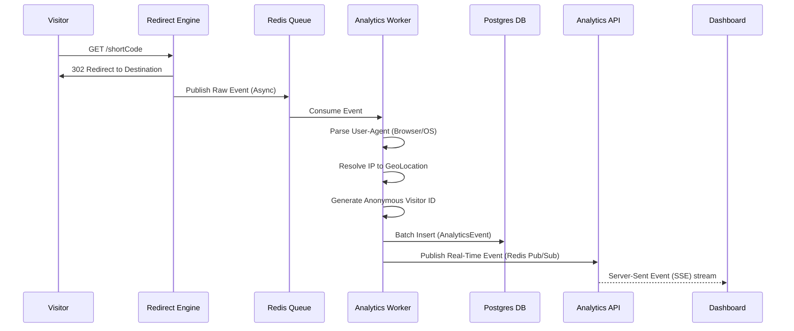

# Event Pipeline - Analytics Platform

This document describes the flow of data from a user click to the analytics dashboard.

## 1. High-Level Flow

## 2. Component Details

### 2.1 The Producer (Redirect Engine)
The Redirect Engine's sole responsibility is fast redirection. 
Upon matching a short link, it extracts:
- IP Address
- User-Agent
- Referrer
- Timestamp
- Short Link ID
It immediately serializes this into JSON and pushes it to a Redis Stream (`analytics:events`), then returns the 302 response to the user.

### 2.2 The Queue (Redis Streams)
We use Redis Streams (or Kafka) for its durability, consumer groups, and high throughput. 
- **Consumer Groups**: Allows us to spin up multiple instances of Analytics Workers that share the load of processing the queue.

### 2.3 The Consumer (Analytics Worker)
A background Node.js process.
1. **Batching**: Pulls events in batches (e.g., 50-100 events) from the queue to optimize database writes.
2. **Enrichment**:
   - Parses the User-Agent string using a library like `ua-parser-js`.
   - Resolves geolocation using Cloudflare Headers or MaxMind.
   - Hashes `IP + User-Agent + DailySalt` to generate a privacy-safe `visitor_id`.
3. **Storage**: Performs a single bulk `INSERT` into the `AnalyticsEvent` PostgreSQL partitioned table.
4. **Real-Time Notification**: Pushes a lightweight notification to Redis Pub/Sub (`analytics:realtime:{link_id}`) which the API layer uses to broadcast to connected SSE clients.

### 2.4 Aggregation Cron Jobs
Instead of updating aggregate tables on every click (which causes row locks and slow writes), we run continuous aggregations.
- A job runs every X minutes (or uses TimescaleDB's native Continuous Aggregates).
- It reads new rows from `AnalyticsEvent` and `UPSERT`s counts into `AggregatedMetrics` tables.

## 3. Failure Handling & Retry Logic
- **Queue Failures**: If the worker fails to process a batch (e.g., DB is down), the events remain unacknowledged in the Redis Stream. The worker will retry them using exponential backoff.
- **Poison Pills**: If a specific event payload is corrupt and repeatedly crashes the worker, after X retries, it is moved to a Dead Letter Queue (DLQ) for manual inspection, allowing the worker to proceed with the rest of the stream.
